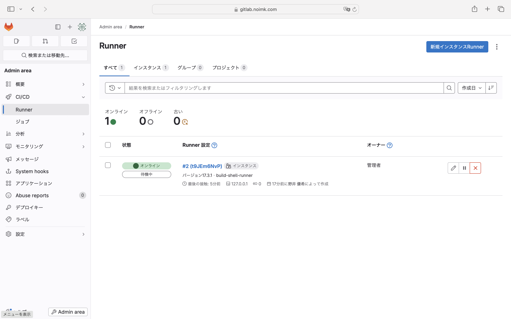

# [GitLab] コンテナビルド & デプロイ
ホストにインストールしたGitLabをリポジトリとしている環境で、特定ブランチにcommitしたときにコンテナをビルドして、自ホストにデプロイする。


## 0. 前提条件
1. GitLab Runnerがインストールされていること

2. podman がインストールされていること
3.  Spring BootプロジェクトがGitLabリポジトリに登録されていること
4.  GitLabのCI/CD設定ファイル（.gitlab-ci.yml）をプロジェクトに追加できること

## 1.GitLab Runnerインストール
```bash
# リポジトリ有効化
curl -L "https://packages.gitlab.com/install/repositories/runner/gitlab-runner/script.rpm.sh" | sudo bash
# インストール
sudo dnf install gitlab-runner
```

任意のホスト名で、自サーバを名前解決できるように、`/etc/hosts`に追記
```bash
127.0.0.1   gitlab.noimk.com
```

## 2. 新規Runner作成
Adminエリアから新規Runnerを作成する


プラットフォームはLinuxを選択し、`ステップ1`で表示されたコマンドを実行。`gitlab-runner register`コマンドの中で指定するexecutorは`shell`を指定する。

```bash
# gitlab-runner register  --url http://gitlab.noimk.com  --token <トークン>

Enter the GitLab instance URL (for example, https://gitlab.com/):
[http://gitlab.noimk.com]: 
Enter a name for the runner. This is stored only in the local config.toml file:
[rhel9]: build-shell-runner
Enter an executor: kubernetes, docker-autoscaler, instance, ssh, parallels, docker, docker-windows, docker+machine, custom, shell, virtualbox:
shell
Runner registered successfully. Feel free to start it, but if it's running already the config should be automatically reloaded!
 
Configuration (with the authentication token) was saved in "/etc/gitlab-runner/config.toml"
```

登録が完了するとGitLab上からもオンライン状態であることが確認できる。


## 3. CI/CDパイプラインの設定
SpringBootプロジェクトのリポジトリのルートに`.gitlab-ci.yml`ファイルを作成

```yaml
image: registry.access.redhat.com/ubi8/openjdk-11

stages:
  - build
  - deploy

variables:
  PROJECT_NAME: "my-springboot-app"
  JAR_NAME: "my-springboot-app.jar"
  REGISTRY: "localhost:5000"
  CONTAINER_NAME: "my-springboot-app-container"

build:
  stage: build
  script:
    - ./gradlew clean build
    - cp build/libs/*.jar ${JAR_NAME}
    - podman build -t ${REGISTRY}/${PROJECT_NAME}:latest .

deploy:
  stage: deploy
  script:
    - podman push ${REGISTRY}/${PROJECT_NAME}:latest
    - podman stop ${CONTAINER_NAME} || true
    - podman rm ${CONTAINER_NAME} || true
    - podman run -d --name ${CONTAINER_NAME} -p 8080:8080 ${REGISTRY}/${PROJECT_NAME}:latest

``


https://qiita.com/kamina/items/bc4b20c6bbc47b98557c

