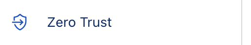
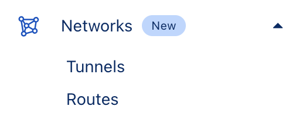
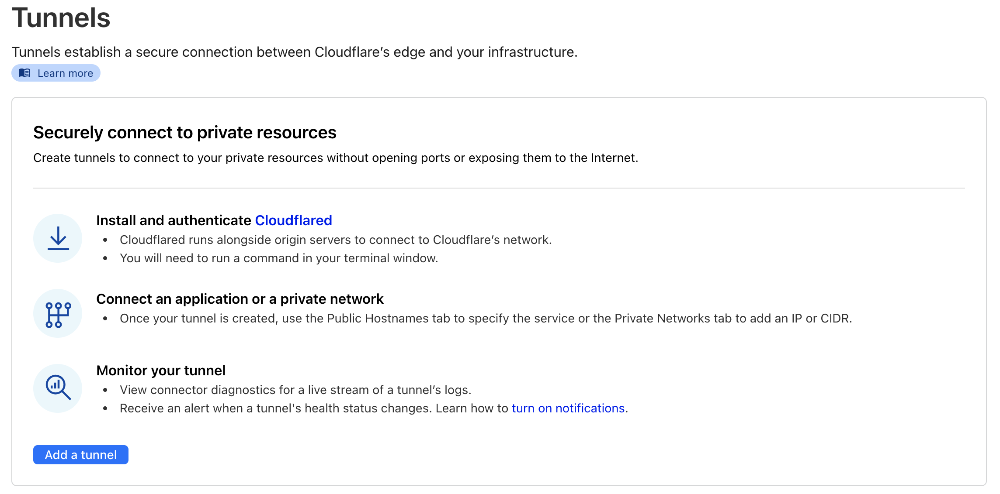
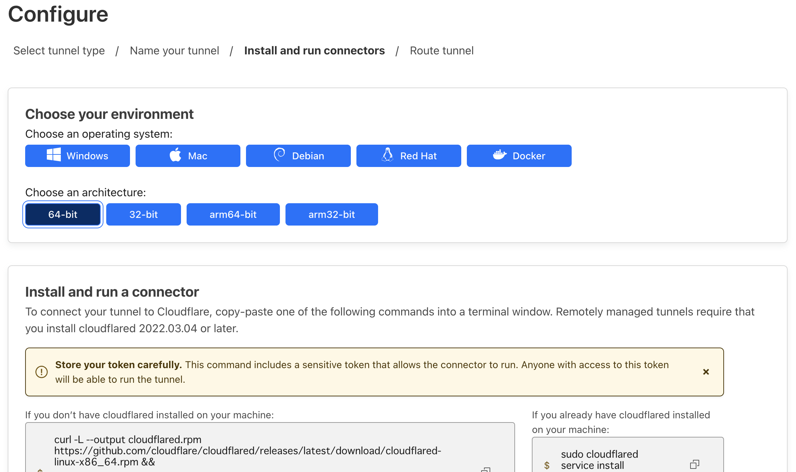
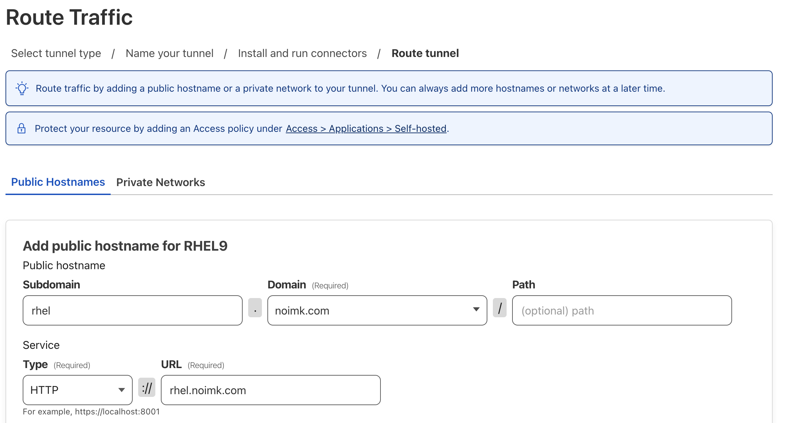

# CloudflareTunnel

1. マネージメントコンソール左ペインでZero Trustをクリック

1. Tunnelsをクリック

1. Add a tunnleをクリック

1. Create a tunnel で以下のように作成する。
   1. Select your connector：Cloudflared
   2. Name your tunnel：適当なトンネル名

1. Configure でトンネル接続したいホスト情報を入力し、ホスト上で実行するコマンドを生成してホスト上で実行する

1. 

code serve-we