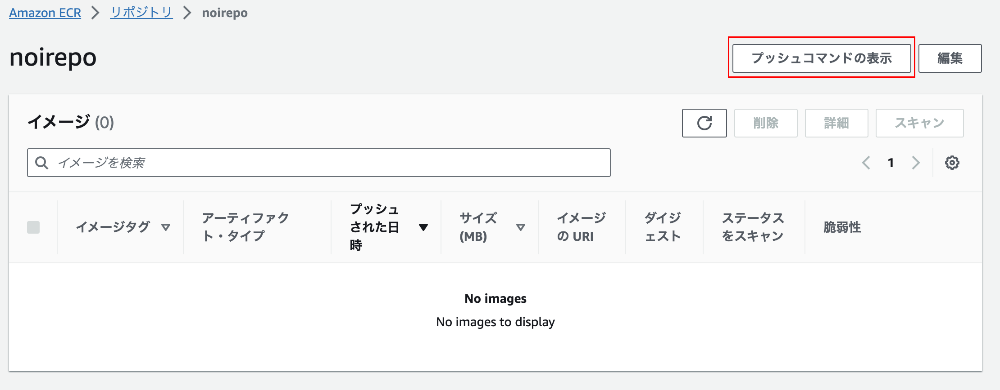
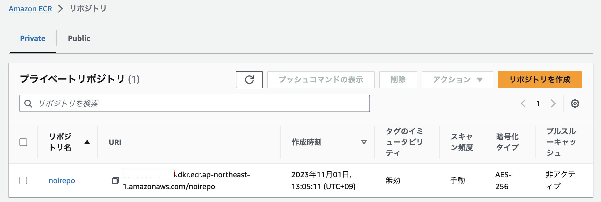

# Lambdaでコンテナを動かす

コンテナイメージの作成は「Spring BootをDocker上で動かす」を参照

## 前提
AWS Lambdaでコンテナを実行する場合、

## ECRへコンテナアップロード
1. AWSのコンソールからECRを開き、リポジトリを作成


リポジトリの設定は以下

- 可視性設定：プライベート
- リポジトリ名：任意

2. [AWS CLIインストール](https://docs.aws.amazon.com/ja_jp/cli/latest/userguide/getting-started-install.html)

3. AWSコンソールの`プッシュコマンドの表示`に記されたコマンドを実行する



```
% aws ecr get-login-password --region ap-northeast-1 | docker login --username AWS --password-stdin XXXX.dkr.ecr.ap-northeast-1.amazonaws.com
Login Succeeded

% docker tag app-hello-spring-boot:latest XXXX.dkr.ecr.ap-northeast-1.amazonaws.com/noirepo:latest
docker tag app-hello-spring-boot:latest 891393919774.dkr.ecr.ap-northeast-1.amazonaws.com/noirepo:latest

% docker images
REPOSITORY                                          TAG       IMAGE ID       CREATED       SIZE
XXXX.dkr.ecr.ap-northeast-1.amazonaws.com/noirepo   latest    991d27fbc07a   6 hours ago   428MB
app-hello-spring-boot                               latest    991d27fbc07a   6 hours ago   428MB

% docker push XXXX.dkr.ecr.ap-northeast-1.amazonaws.com/noirepo:latest
```

AWSコンソールを確認するとコンテナイメージが登録されていることが確認できる



## API Gatewayの構築
1. AWSコンソールからAPI Gatewayを開き、APIを作成する
- APIタイプを選択：HTTP API
- 統合：Lambda > コンテナイメージをデプロイしたLambda関数を指定
- ルートを設定

## Lambdaへデプロイ