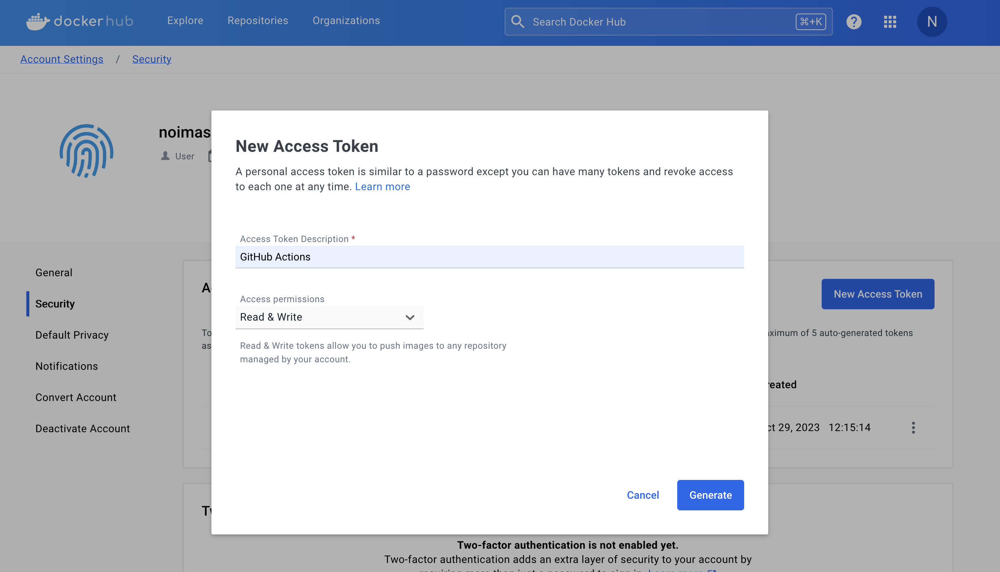

# GitHubActionsを利用した自動ビルド

GitHubActionsを利用してSpringBootプロジェクトのビルド→コンテナビルド→DockerHubへPushを自動化する

## 必要なもの
- GitHubアカウント
- DockerHubアカウント

## 1. DockerHubアクセストークンの発行
ビルドしたコンテナをDocker Hubへpushするときに、必要なアクセストークンキーをDocker Hubで発行する。

[Account / Security](https://hub.docker.com/settings/security)から、[New Access Token]を選択

任意の名前と、[Access permissions]を選択して、[Generate]



トークンが表示されるので、手元に控えておく


## 2. GitHubへトークン情報の登録
自動化したいリポジトリで[Settings > Secrets and variables > Actions]から[New repository secret]を選択


`DOCKERHUB_TOKEN`をNameに設定して、DockerHubで取得したアクセストークンをValueに設定して、[Add secret]する


同様にして、`DOCKERHUB_USERNAME`としてDocker Hubのユーザ名を作成する。


## 3. GitHub Actionsの設定
実現したい要件は以下
1. Springプロジェクトのビルド（Jar）
2. コンテナビルド & DockerHubへpush

まずはリポジトリに、GitHub Actions設定用のYAMLファイルを作成して、ここに記載をしていく。

`.github/workflows/docker-build.yaml`

Java（Maven）のビルドはGitHubActions作成時に提案される[Java with Maven]を参考にする。

Dockerイメージのビルド・DockerHubへのpushは[公式ドキュメント](https://github.com/marketplace/actions/build-and-push-docker-images)を参考にする。

今回の要件を満たすワークフローは以下

```{code-block} yaml
:caption: .github/workflows/docker-build.yaml

# 名前
name: "Docker image build and push to DockerHub"

# onセクション
# ：このワークフローがいつ実行されるかを定義
on:
  push:
    branches:
      - 'main'  # mainブランチにpushされたときに実行

# jobsセクション
# ：ワークフローの中で行う作業をjobIDとして定義する。各jobIDは並列に処理される。
jobs:
  # jobID
  docker:
    runs-on: ubuntu-latest # 実行環境（ランナー）を指定
    steps:
      -
        # リポジトリのコードをランナーへチェックアウト
        name: Checkout
        uses: actions/checkout@v3
      -
        name: Set up JDK
        uses: actions/setup-java@v3
        with: # Java環境のオプション指定（作成したSpringプロジェクトに合わせる）
          java-version: '17'
          distribution: 'temurin'
          cache: maven
      -
        name: Build backend-item
        run: |
          cd backend-item
          mvn -B package spring-boot:repackage -DskipTests
      -
        name: Build frontend-webapp
        run: |
          cd frontend-webapp
          mvn -B package spring-boot:repackage -DskipTests
      -
        # マルチプラットフォームのビルドをサポートするためQEMUをセットアップ（任意）
        name: Set up QEMU
        uses: docker/setup-qemu-action@v3
      -
        # マルチプラットフォームのビルドをサポートするためQEMUをセットアップ（任意）
        name: Set up Docker Buildx
        uses: docker/setup-buildx-action@v3
      -
        name: Login to Docker Hub
        uses: docker/login-action@v3
        with:
          username: ${{ secrets.DOCKERHUB_USERNAME }}
          password: ${{ secrets.DOCKERHUB_TOKEN }}
      -
        name: Build and push（backend-item）
        uses: docker/build-push-action@v5
        with:
          context: ./backend-item
          push: true  # Dockerイメージのビルド後に自動的にDocker Hubにプッシュするかどうか
          tags: ${{ secrets.DOCKERHUB_USERNAME }}/backend-item:latest
      -
        name: Build and push（frontend-webapp）
        uses: docker/build-push-action@v5
        with:
          context: ./frontend-webapp
          push: true  # Dockerイメージのビルド後に自動的にDocker Hubにプッシュするかどうか
          tags: ${{ secrets.DOCKERHUB_USERNAME }}/frontend-webapp:latest
```

開発環境でcommitすると、DockerHubへDockerイメージが自動でpushされる。
