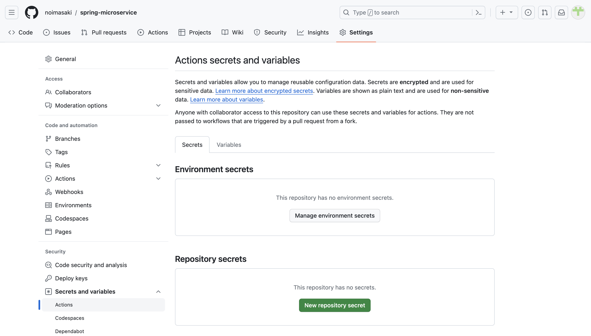
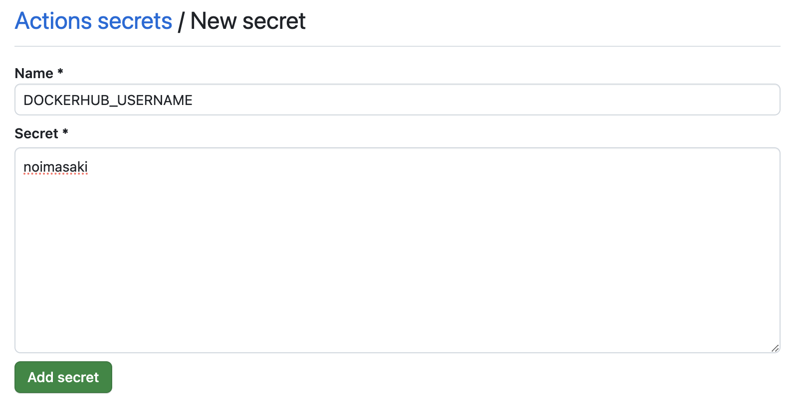

# GitHubActionsを利用した自動ビルド

GitHubActionsを利用してSpringBootプロジェクトのビルド→コンテナビルド→DockerHubへPushを自動化する

## 必要なもの
- GitHubアカウント
- DockerHubアカウント

## 1. DockerHubアクセストークンの発行
ビルドしたコンテナをDocker Hubへpushするときに、必要なアクセストークンキーをDocker Hubで発行する。

[Account / Security](https://hub.docker.com/settings/security)から、[New Access Token]を選択

任意の名前と、[Access permissions]を選択して、[Generate]

トークンが表示されるので、手元に控えておく

## 2. GitHubへトークン情報の登録
自動化したいリポジトリで[Settings > Secrets and variables > Actions]から[New repository secret]を選択

`DOCKERHUB_TOKEN`をNameに設定して、DockerHubで取得したアクセストークンをValueに設定して、[Add secret]する

同様にして、`DOCKERHUB_USERNAME`としてDocker Hubのユーザ名を作成する。

## 3. GitHub Actionsの設定
実現したい要件は以下
1. Springプロジェクトのビルド（Jar）
2. コンテナビルド & DockerHubへpush

まずはリポジトリに、GitHub Actions設定用のYAMLファイルを作成して、ここに記載をしていく。

`.github/workflows/docker-build.yaml`

#### 3-1. Springプロジェクトのビルド

#### 3-2. コンテナイメージビルド & push
[公式ドキュメント](https://github.com/marketplace/actions/build-and-push-docker-images)を参考にする

