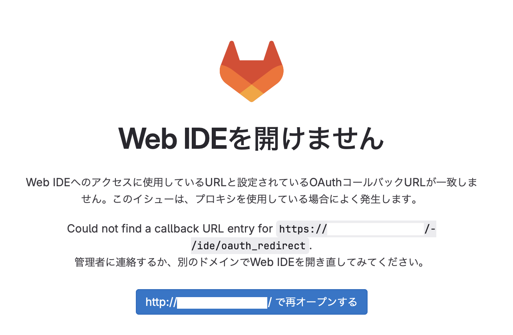
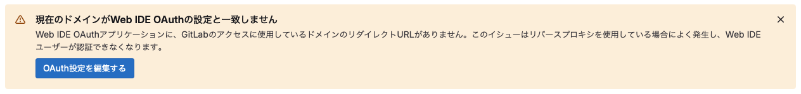
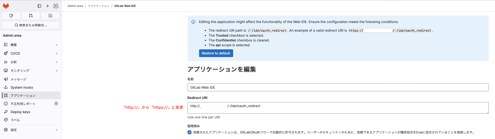

# Cloudflare 経由で GitLab を利用する

Cloudflare などの、リバースプロキシ経由で GitLab にアクセスすると、時にエラーが発生する時があります。たとえば、WebIDE を利用とするとこのようなエラーが出ました。



そこで、リバースプロキシ経由で GitLab にアクセスするときの設定方法を記述します。

## 前提

構成は以下のとおりです。

```bash
[ブラウザ]
   |
   | (https://myGitLab.com/)
   v
[Cloudflare]
   |
   | (HTTP通信に変換)
   v
[GitLabサーバー (HTTPでリッスン)]
```

## 1. external_url の設定

`/etc/gitlab/gitlab.rb`を編集します。

```bash
# 変更前
external_url 'http://your-domain.com'

# 変更後
external_url 'https://your-domain.com'
```

external_url は、GitLab が内部で使用する基本的な URL を指定する設定です。これには以下が含まれます：

- GitLab が生成するリンク（例：通知メール内のリンク）
- リダイレクト URL
- OAuth コールバック URL
- 組み込みの Nginx 設定で使用されるホスト名とプロトコル

重要な点： external_url は、ユーザーが実際にアクセスする URL と一致させる必要があります。

## 2.　 Nginx が HTTP でリクエストを受け取るように設定

external_url を http から https に変更すると、GitLab はデフォルトの設定では 80 番ポートから 443 番ポートへリッスンポートを変更します。
ただし、今回の構成ではリバースプロキシである Cloudflare までを https 通信とし、GitLab では http で受け付ける構成とします。（https 用の証明書管理を自分でやりたくない）

GitLab 内部で動作する Nginx の設定を変更するために、`/etc/gitlab/gitlab.rb`を編集します。

```bash
# 変更前
# nginx['listen_port'] = nil
# nginx['listen_https'] = nil

# 変更後
nginx['listen_port'] = 80
nginx['listen_https'] = false
```

これで、GitLab の組み込み Nginx が HTTPS ではなく HTTP でリクエストを受け取るように設定できました。

## 3.リバースプロキシからのヘッダーを信頼する設定

```bash
# 変更前
# nginx['proxy_set_headers'] = {
#  "Host" => "$http_host_with_default",
#  "X-Real-IP" => "$remote_addr",
#  "X-Forwarded-For" => "$proxy_add_x_forwarded_for",
#  "X-Forwarded-Proto" => "https",
#  "X-Forwarded-Ssl" => "on",
#  "Upgrade" => "$http_upgrade",
#  "Connection" => "$connection_upgrade"
# }

# 変更後
nginx['proxy_set_headers'] = {
  "X-Forwarded-For" => "$proxy_add_x_forwarded_for",
  "X-Forwarded-Proto" => "https",
  "X-Forwarded-Ssl" => "on",
  "Host" => "$http_host",
  "Upgrade" => "$http_upgrade",
  "Connection" => "$connection_upgrade"
}
```

1. ヘッダーが必要な理由

   - リバースプロキシを使用する場合、実際のクライアント（ブラウザなど）はまず Cloudflare のようなプロキシサーバーにリクエストを送ります。プロキシサーバーがそのリクエストを受け取り、内部の GitLab サーバーに転送します。このとき、GitLab サーバーはリクエストの最初の送信元（ブラウザ）やプロトコル（HTTP か HTTPS か）など、もともとのリクエストに関する情報を直接受け取れなくなります。
   - ヘッダーは、リバースプロキシが元のリクエスト情報（クライアント情報、プロトコルなど）を GitLab に伝えるために使われます。これによって、GitLab は元のクライアントの IP アドレスや、リクエストが HTTPS 経由であったかなどを認識できます。

2. 各ヘッダーの役割と期待される動作

- X-Forwarded-For
  - 役割: クライアントの実際の IP アドレスを GitLab に伝えるためのヘッダーです。
  - 動作: 通常、GitLab サーバーはプロキシサーバー（Cloudflare）の IP アドレスしか認識できません。このヘッダーを使うことで、GitLab はリクエストを実際に送信したクライアントの IP アドレスを認識でき、アクセス制御やログ解析などに正しい情報を使えます。
- X-Forwarded-Proto
  - 役割: クライアントが HTTPS でアクセスしているか HTTP でアクセスしているかを GitLab に伝えるヘッダーです。
  - 動作: Cloudflare が HTTPS 通信を扱い、その後 GitLab に HTTP でリクエストを転送している場合でも、GitLab がリクエストが本来 HTTPS であったことを認識します。これにより、GitLab はリダイレクトやセキュリティ機能で正しく HTTPS の URL を使えます。
- X-Forwarded-Ssl
  - 役割: リクエストが SSL を使って送信されていることを GitLab に伝えるためのヘッダーです。
  - 動作: これによって、GitLab はリクエストが SSL（HTTPS）経由で送られていると認識し、適切な動作（セキュアな通信の継続やリダイレクト）を行います。
- Host
  - 役割: 元のリクエストのホスト名を GitLab に伝えるヘッダーです。
  - 動作: リバースプロキシ経由でアクセスする際、GitLab はリクエストの元のホスト名（ドメイン）を知らないため、これを明示的に伝えることで正しいドメイン名を認識させます。これがないと、GitLab が内部的に生成する URL が不正確になる可能性があります。
- Upgrade
  - 役割: WebSocket などの接続のアップグレード要求を伝えるためのヘッダーです。
  - 動作: 通常の HTTP 接続から WebSocket などにプロトコルを変更する際、GitLab にその要求を正しく伝え、プロトコルの変更をサポートします。
- Connection
  - 役割: クライアントとサーバー間で、どのコネクションを維持するかを決定するためのヘッダーです。特に Upgrade ヘッダーと連携して使われます。
  - 動作: このヘッダーがないと、WebSocket などの持続的な接続が確立できない場合があります。

3. この設定を行う理由と効果
   リバースプロキシを通じて GitLab にアクセスする際、元のリクエスト情報が失われないようにこれらのヘッダーを設定します。具体的には、以下の効果が期待されます。

- セキュリティ: X-Forwarded-Proto や X-Forwarded-Ssl により、リクエストが HTTPS 経由であったことを GitLab が認識し、HTTPS 通信が強制される場面で正しい動作をします。
- 正確なアクセスログ: X-Forwarded-For により、GitLab は実際のクライアント IP を認識でき、正確なアクセスログを残すことができます。
- 正しい URL 生成: Host ヘッダーにより、GitLab が正しいドメイン名でリンクやリダイレクトを生成します。

## 4. Cloudflare の IP アドレスを信頼するプロキシとして設定

```bash
# 変更前
# gitlab_rails['trusted_proxies'] = []

# 変更後
gitlab_rails['trusted_proxies'] = [
  '173.245.48.0/20',
  '103.21.244.0/22',
  '103.22.200.0/22',
  '103.31.4.0/22',
  '141.101.64.0/18',
  '108.162.192.0/18',
  '190.93.240.0/20',
  '188.114.96.0/20',
  '197.234.240.0/22',
  '198.41.128.0/17',
  '162.158.0.0/15',
  '104.16.0.0/12',
  '172.64.0.0/13',
  '131.0.72.0/22'
]
```

最新の Cloudflare の IP アドレス範囲は以下から確認し、必要に応じて更新してください。

- IPv4: [https://www.cloudflare.com/ips-v4](https://www.cloudflare.com/ips-v4)
- IPv6: [https://www.cloudflare.com/ips-v6](https://www.cloudflare.com/ips-v6)

## 5. 設定の反映・再起動

gitlab.rb を編集後は、設定の反映と再起動が必要となります。root ユーザで以下を実行します。

```bash
# 設定再構築
gitlab-ctl reconfigure

# GitLab再起動
gitlab-ctl restart
```

## 6. OAuth 設定の編集

ここまでの設定変更を実施しても、WebIDE は正常に利用できませんでした。Admin area を確認すると、次のようなポップアップが出ていました。



そこで、アプリケーション設定から WebIDE の設定画面を開き、`Redirect URI`を「http -> https」に変更したところ、WebIDE が正常に利用できるようになりました。



### 解説

1. OAuth 2.0 と Redirect URI の役割

   - OAuth 2.0 は、クライアントアプリケーションがリソース所有者に代わってリソースサーバーにアクセスするための認可プロトコルです。
   - Redirect URI は、認可サーバーが認可コードやアクセストークンをクライアントに返す際のリダイレクト先の URL です。
   - セキュリティ上、認可サーバーは事前に登録された Redirect URI と、実際のリクエストで提供される Redirect URI が完全に一致することを要求します。

2. GitLab の Web IDE における OAuth のフロー

   - Web IDE は GitLab 内でホストされるクライアントアプリケーションであり、ユーザーがコードを編集する際にユーザー認証が必要です。
   - この認証には OAuth 2.0 を使用し、ユーザーの権限を確認します。
   - OAuth のフローでは、ユーザーが認可サーバー（GitLab）からクライアントアプリケーション（Web IDE）にリダイレクトされる必要があります。

3. http と https の不一致による問題

   - 今回の環境では、ユーザーはhttps://my-domain.comでGitLabにアクセスしていますが、Web IDE の Redirect URI がhttp://my-domain.comになっていたため、不一致が発生しました。
   - OAuth 2.0 の仕様では、登録された Redirect URI とリクエスト時の Redirect URI が完全に一致しなければなりません。http と https の違いも不一致と見なされます。
   - この不一致により、認可コードの受け渡しが正しく行われず、Web IDE での認証が失敗していました。

4. Redirect URI を https に変更した効果

   - Redirect URI をhttps://your-domain.com/-/ide/oauth_redirectに変更することで、ユーザーが実際にアクセスしているURLと一致しました。
   - これにより、OAuth のリダイレクトが正常に行われ、Web IDE での認証が成功するようになりました。
