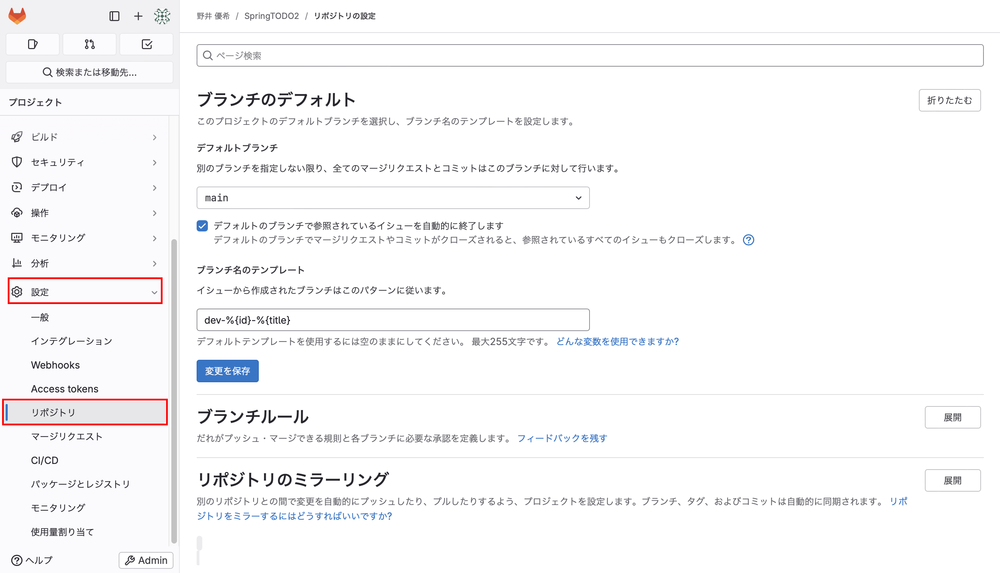

# プロジェクトルールのサンプル

あくまで自分向けのサンプル。

## 1. ブランチ戦略

- `main`ブランチから作業用ブランチ`dev-%{issueid}-%{task name}`を作成する。
- 作業用ブランチはタスクに紐づくイシューから作成する
- タスクが完了したら、`main`ブランチへマージする。

上記を満たす為、ブランチの設定は次のようにする。

| 項目                     | 設定値               |
| ------------------------ | -------------------- |
| デフォルトブランチ       | `main`               |
| イシューを自動で終了     | 有効                 |
| ブランチ名のテンプレート | `dev-%{id}-%{title}` |
