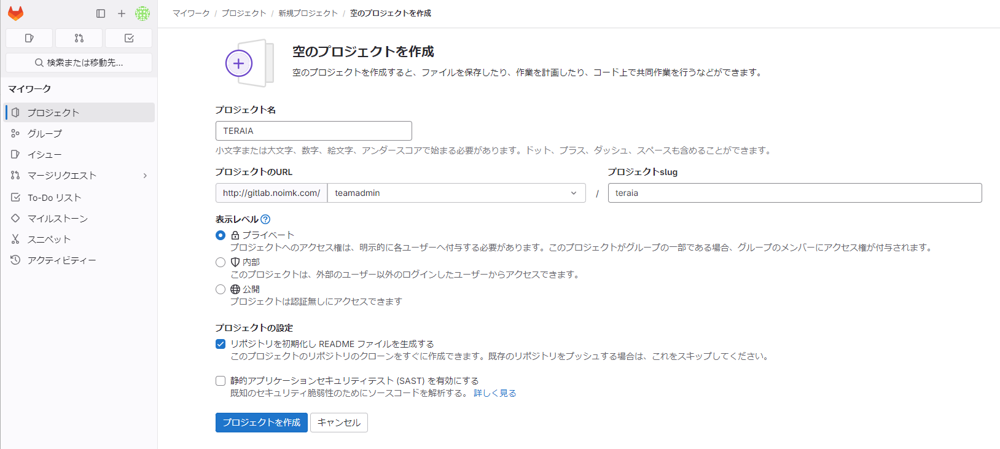

# GitLabプロジェクト作成

## 1. GitLabサーバ側の作業


1. `グループを作成`から、グループを作成

    

    ```{note}
        `Admin area > 新規ユーザ`からGitlabへユーザを追加した後に、グループにユーザを追加する。
    ```

2. `プロジェクトを作成` から、プロジェクトを作成

    

3. 


## 2. ローカル側の作業

最初に既存のコードをリモートリポジトリへアップロードする

```{code-block}
# gitインストール（インストール済みであればスキップ）
dnf install git

# git管理対象ディレクトリへ移動
cd /TERA_IA/

# ローカルGitリポジトリを初期化
git init

# すべてのファイルをステージング
git add .

# 最初のコミットを作成
git commit -m "Initial commit"

# リモートリポジトリ追加
git remote add origin http://<your-server-ip>/<your-username>/<your-project>.git

# ローカルリポジトリをリモートへpush
git push -u origin master

# ローカルのブランチを確認
git branch

# ローカルのブランチをGitlabのmainに合わせてリネーム
git branch -m master main


```

## 3. コードの作成・修正
GitLab上で実施する。

## 4. コードのpull・実行
リモートリポジトリのmainブランチからローカルのmainブランチへ同期
```
# リモートリポジトリから変更を取得し、ローカルの現在のブランチに直接マージ
git pull origin main
```

