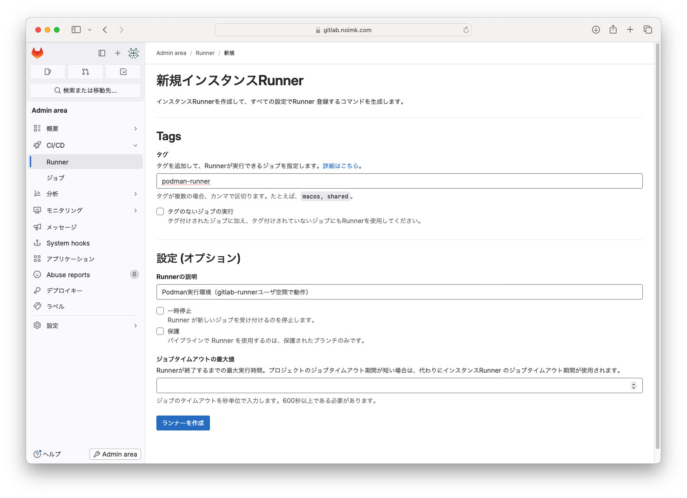

# GitLabRunnerによるCICD
GitLab Runnerとは、GitLab CI/CD（継続的インテグレーション/継続的デリバリー）パイプラインでジョブを実行するための軽量なエージェントでる。
コードのビルド、テスト、デプロイなどのタスクを自動化するために使われる。GitLab CI/CDで定義されたジョブを受け取り、そのジョブを指定された環境（例えばDockerコンテナや仮想マシン）で実行する。

## 目指すもの


- GitLabのリポジトリのソースコードをビルドして、同一サーバ上のPodmanにデプロイ
- ソースコードのビルド環境はGコンテナ（docker executoを利用する）

## 1. GitLab Runnerインストール
```bash
# リポジトリ有効化
curl -L "https://packages.gitlab.com/install/repositories/runner/gitlab-runner/script.rpm.sh" | sudo bash
# インストール
sudo dnf install gitlab-runner
```

任意のホスト名で、自サーバを名前解決できるように、`/etc/hosts`に追記
```bash
127.0.0.1   gitlab.noimk.com
```

## 2. gitlab-runnerユーザでのpodman利用準備
dnfコマンドでgilab-runnerをインストールすると、gitlab-runnerユーザが自動で追加される。今回は、Runner実行環境をpodmanのgitlab-runnerユーザ空間にて動作させるようにするため、gitlab-runnerユーザでpodmanが正常に利用可能となるように設定変更を実施する。

1. lingering を有効化し、gitlab-runnerがログインしていなくてもバックグラウンドでpodmanをgitlab-runnerユーザ空間で利用可能とする
```
sudo loginctl enable-linger gitlab-runner
```

2. gitlab-runnerユーザにスイッチ
```
sudo -u gitlab-runner -i
```

3. podman関連の環境変数を設定
```
echo 'export XDG_RUNTIME_DIR="/run/user/$UID"' >> ~/.bash_profile
echo 'export DBUS_SESSION_BUS_ADDRESS="unix:path=${XDG_RUNTIME_DIR}/bus"' >> ~/.bash_profile
```

4. 環境変数を反映
```
source ~/.bash_profile
```

5. gitlab-runnerユーザのPodmanソケットをリッスン
```
systemctl --user enable --now podman.socket
```

6. gitlab-runnerユーザのPodmanリッスンポイントを確認
```
[gitlab-runner@rhel9 ~]$ systemctl --user status podman.socket
● podman.socket - Podman API Socket
     Loaded: loaded (/usr/lib/systemd/user/podman.socket; enabled; preset: disabled)
     Active: active (listening) since Mon 2024-09-02 10:51:12 JST; 52s ago
      Until: Mon 2024-09-02 10:51:12 JST; 52s ago
   Triggers: ● podman.service
       Docs: man:podman-system-service(1)
     Listen: /run/user/969/podman/podman.sock (Stream)
     CGroup: /user.slice/user-969.slice/user@969.service/app.slice/podman.socket
```

Listenの　*/run/user/969/podman/podman.sock* をRunner登録で利用するため、控えておく。

7. gitlab-runnerのUIDとGIDの定義
    gitlab-runnerユーザ名前空間を使用してコンテナを実行する（ルートレスモード）。そこで、ユーザが使用するUIDとGIDの範囲を定義する。
```
# まず、gitlab-runnerユーザのエントリが存在するか確認
cat /etc/subuid
cat /etc/subgid

# もしgitlab-runnerユーザーのエントリがない場合、以下のようにエントリを追加
echo 'gitlab-runner:100000:65536' | sudo tee -a /etc/subuid
echo 'gitlab-runner:100000:65536' | sudo tee -a /etc/subgid
```

8. UIDとGIDの設定を反映させるために、以下のコマンドを実行してPodmanのシステムをマイグレーション
```
podman system migrate
```


## 3. 新規Runner作成
`Admin area > CI/CD > Runner` から `新規インスタンスRunner`を作成する。


プラットフォームはLinuxを選択し、`ステップ1`で表示されたコマンドを実行

| 項目                 | 設定内容 | 説明                               |
| -------------------- | -------- | ---------------------------------- |
| GitLab instance URL  | 空欄     |                                    |
| name for the runner  | 任意     | Runner名                           |
| executor             | docker   | Runner実行環境をコンテナとする     |
| default Docker image | 任意     | Runnerコンテナのデフォルトイメージ |

```bash
Runtime platform                                    arch=amd64 os=linux pid=853848 revision=66269445 version=17.3.1
Running in system-mode.
Enter the GitLab instance URL (for example, https://gitlab.com/):
[http://gitlab.noimk.com]: 
Verifying runner... is valid                        runner=PNwb9MBy7
Enter a name for the runner. This is stored only in the local config.toml file:
[rhel9]: podman-runner
Enter an executor: instance, custom, parallels, kubernetes, docker, docker-windows, docker+machine, docker-autoscaler, shell, ssh, virtualbox:
docker
Enter the default Docker image (for example, ruby:2.7):
centos:latest
Runner registered successfully. Feel free to start it, but if it's running already the config should be automatically reloaded!
 
Configuration (with the authentication token) was saved in "/etc/gitlab-runner/config.toml"
```

```{note}
同様に、executorをshellとしたものも作成しておく。
```

## 4. Runner設定変更
設定ファイルである、`/etc/gitlab-runner/config.toml`に下記を追記する

```
[[runners]]
  clone_url = "http://gitlab.noimk.com"
  [runners.docker]
    network_mode = "host"
    host = "unix:///run/user/969/podman/podman.sock"
    pull_policy = ["if-not-present"]
```

| 設定値                                           | 説明                                                                                                                                                                                      |
| ------------------------------------------------ | ----------------------------------------------------------------------------------------------------------------------------------------------------------------------------------------- |
| clone_url = "http://gitlab.noimk.com"            | cloneするリポジトリ                                                                                                                                                                       |
| network_mode = "host"                            | RunnerコンテナのNWモード。<br>"gitlab.noimk.com"はhostsにより"127.0.0.1"となるが、デフォルトのBrigeモードだとコンテナ自身を指し示すため、<br>GitLabへ到達できない。そこで、Hostモードへ変更する。 |
| host = "unix:///run/user/969/podman/podman.sock" | gitlab-runnerユーザのpodmanソケットを指定することで、Runnerコンテナが該当ユーザのpodman上で動作する                                                                                       |
| pull_policy = ["if-not-present"]                 | Runnerコンテナイメージが、"もしローカルに存在しない場合はDockerHubからpullする"                                                                                                           |

設定変更が完了したら、設定反映のためgitlab-runnerをrestartする
```
sudo gitlab-runner restart
```

## 5. CI/CDパイプライン作成
リポジトリのルートに`.gitlab-ci.yml`を作成して、パイプラインを定義する。

```yaml
image: maven:3.8-eclipse-temurin-17

stages:
  - build
  - deploy

variables:
  SPRING_ARTIFACT_ID: "todo"
  CONTAINER_PORT: "8080"
  BIND_PORT: "8081"
  CONTAINER_IMAGE_NAME: "${CI_PROJECT_NAME}-${CI_COMMIT_REF_SLUG}-image"
  CONTAINER_NAME: "${CI_PROJECT_NAME}-${CI_COMMIT_REF_SLUG}"

before_script:
  - echo "Container image name is <Repository>-<Branch>-image"
  - echo "Container name is <Repository>-<Branch>"
  - echo "Repository = ${CI_PROJECT_NAME}"
  - echo "Branch     = ${CI_COMMIT_REF_SLUG}"


build:
  stage: build
  tags:
    - podman-runner
  script:
    - cd ./${SPRING_ARTIFACT_ID}
    - ./mvnw package
    - ls -l target
  artifacts:
    paths:
      - ./${SPRING_ARTIFACT_ID}/target/*.jar


# ----- TODO -----
# このジョブだと新しいブランチを切ってcommitしたときに古いコンテナが起動したままとなるので、同一ポートを利用してエラーとなってしまう
# 例えば、mainブランチは8081ポート、devブランチは8082ポートなど、新たなジョブを定義する必要がある？


deploy:
  stage: deploy
  tags:
    - shell-runner
  script:
    # 同一名のコンテナが存在する場合は削除
    - |
      if podman ps -a --format '{{.Names}}' | grep -w ${CONTAINER_NAME}; then
        echo "${CONTAINER_NAME} 削除します"
        podman stop ${CONTAINER_NAME}
        podman rm ${CONTAINER_NAME} 
      fi
    # 同一名のコンテナイメージが存在する場合は削除
    - |
      if podman images --format '{{.Repository}}:{{.Tag}}' | grep -w ${CONTAINER_IMAGE_NAME}:latest; then
        echo "${CONTAINER_IMAGE_NAME} 削除します"
        podman rmi ${CONTAINER_IMAGE_NAME}
      fi
    # 新しいイメージをビルド
    - podman build -t ${CONTAINER_IMAGE_NAME} .
    # コンテナ起動
    - podman run -d -p ${BIND_PORT}:${CONTAINER_PORT} --name ${CONTAINER_NAME} ${CONTAINER_IMAGE_NAME}

```


## 参考
- [CI/CDを使ったアプリケーションの構築](https://gitlab-docs.creationline.com/ee/topics/build_your_application.html)
- [podman](https://gitlab-docs.creationline.com/runner/executors/docker.html#podman%E3%82%92%E4%BD%BF%E3%81%A3%E3%81%A6docker%E3%82%B3%E3%83%9E%E3%83%B3%E3%83%89%E3%82%92%E5%AE%9F%E8%A1%8C%E3%81%97%E3%81%BE%E3%81%99)
-  [qiita](https://qiita.com/masa2223/items/d287a2f2b6f6a9367a51)
-  [qiita](https://qiita.com/kamina/items/bc4b20c6bbc47b98557c)
