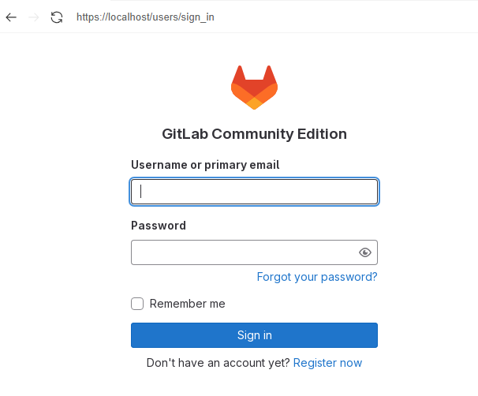

# コンテナでGitlabを起動する
GitLab Community Edition（CE版はMITライセンス、EE版は商用ライセンス）をコンテナで利用できるようにする。

[公式サイト](https://docs.gitlab.com/ee/install/docker.html)を参考にする。

## 前提条件
- podmanがインストールされていること（`dnf install podman`）
- podman-composeがインストールされていること（`dnf install podman-compose`）

## 1. マウント用ディレクトリ作成
```
# GitLab用
mkdir /srv/gitlab

# GitLabRunner用
mkdir /srv/gitlab-runner
```

## 2. docker-compose.yml作成
```
vi /srv/gitlab/docker-compose.yml
```

要件は
- `gitlab-ce`で構築
- `GITLAB_OMNIBUS_CONFIG`で設定を変更することができる
- 22番ポートはホストOSのsshdで使われているので2224ポートに変更

```{code-block}
:caption: /srv/gitlab/docker-compose.yml

version: '3.6'
services:
  gitlab:
    image: 'docker.io/gitlab/gitlab-ce:latest'
    restart: always
    hostname: 'gitlab.example.com'
    container_name: gitlab
    environment:
      GITLAB_OMNIBUS_CONFIG: |
        external_url 'https://gitlab.example.com'
        gitlab_rails['gitlab_shell_ssh_port'] = 2224
        gitlab_rails['initial_root_password'] = '1qaz"WSX'
        gitlab_rails['locale'] = 'ja'

    ports:
      - '80:80'
      - '443:443'
      - '2224:22'
    volumes:
      - '/srv/gitlab/config:/etc/gitlab'
      - '/srv/gitlab/logs:/var/log/gitlab'
      - '/srv/gitlab/data:/var/opt/gitlab'
    shm_size: '256m'
  gitlab-runner:
    image: 'docker.io/gitlab/gitlab-runner:latest'
    restart: always
    container_name: gitlab-runner
    volumes:
      - /srv/gitlab-runner/config:/etc/gitlab-runner
      - /var/run/docker.sock:/var/run/docker.sock
```


## 3. コンテナ作成
```
cd /srv/gitlab/
podman-compose up -d
```

構築中のログは、`podman logs -f gitlab`で確認できる。

STATUSがstartingはまだコンテナの構築中。STATUSはhealthyになったら構築完了

```{code-block}
:caption: まだ構築中

CONTAINER ID  IMAGE                                  COMMAND               CREATED         STATUS                    PORTS
e76e46a7ee37  docker.io/gitlab/gitlab-ce:latest      /assets/wrapper       24 seconds ago  Up 24 seconds (starting)  （略）
3386d2c537de  docker.io/gitlab/gitlab-runner:latest  run --user=gitlab...  5 seconds ago   Up 5 seconds
```

```{code-block}
:caption: 完了

CONTAINER ID  IMAGE                                  COMMAND               CREATED        STATUS                  PORTS
e76e46a7ee37  docker.io/gitlab/gitlab-ce:latest      /assets/wrapper       3 minutes ago  Up 3 minutes (healthy)  （略）
3386d2c537de  docker.io/gitlab/gitlab-runner:latest  run --user=gitlab...  2 minutes ago  Up 2 minutes
```

## 4. GitLabへアクセス
`https://【サーバのIPアドレス】/`でアクセス可能。ローカルから行く場合は[https://localhost/](https://localhost/)




GitLabの初期ユーザ（root）のパスワードは以下のいずれかで確認できる。catしているファイルは同一
```
# ホストOS上のファイルを直アクセス
cat /srv/gitlab/config/initial_root_password

# コンテナ経由でホストOS上のファイルへアクセス
podman exec gitlab cat /etc/gitlab/initial_root_password
```

## 5. デーモン化
ホストOS起動時に、コンテナも自動起動されるようにコンテナをsystemdに登録する。podmanの場合はserviceファイルを生成するコマンドが用意されている。

```
# 対象コンテナ確認
# podman ps -a
CONTAINER ID  IMAGE                                  STATUS                       NAMES
ace56cd29adf  docker.io/gitlab/gitlab-ce:latest      Up About a minute (healthy)  gitlab
7a9fdc677732  docker.io/gitlab/gitlab-runner:latest  Up 5 seconds                 gitlab-runner

# serviceファイル生成
podman generate systemd --new --files --name gitlab
podman generate systemd --new --files --name gitlab-runner
```

実行したディレクトリにserviceファイルが生成されるので、`/etc/systemd/system`にユニットファイルをコピーしてrootユーザとしてインストールする。
```
cp -Z container-gitlab.service /etc/systemd/system
cp -Z container-gitlab-runner.service /etc/systemd/system
```

有効化する
```
systemctl daemon-reload
systemctl enable --now container-gitlab.service
systemctl enable --now container-gitlab-runner.service
```

状態確認
```
systemctl status container-gitlab.service
systemctl status container-gitlab-runner.service
```


## [option] URL変更
`docker-compose.yml`で起動したコンテナにおいて、URLつまり`external_url`を変更したくなったときは以下の手順を実施する。

1. コンテナログイン

```
podman exec -it gitlab bash
```

1. 設定ファイル修正

```
vi /etc/gitlab/gitlab.rb
```

```
★編集前
## GitLab URL
# external_url 'GENERATED_EXTERNAL_URL'

★編集後
## GitLab URL
external_url 'http://gitlab.noimk.com'
```

1. gitlab再構成

```
gitlab-ctl reconfigure
```

Cloudflare tunnelでアクセスする場合は、このような構成でCloudflare tunnelの設定を実施する


```{note}
https://sky-joker.tech/2024/03/30/gitlab-runner%E3%81%A6%E3%82%99podman%E3%82%92%E4%BD%BF%E3%81%86%E3%83%A1%E3%83%A2/

https://qiita.com/masa2223/items/d287a2f2b6f6a9367a51
```

