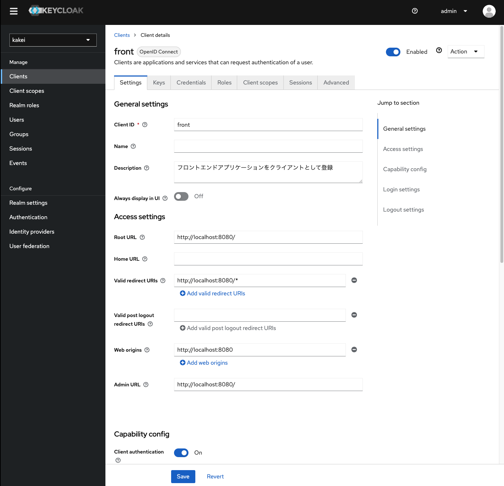

# Keycloak入門
[Keycloak](https://www.keycloak.org/getting-started/getting-started-docker)で認証サーバーを立てて、Spring Securityで保護されたアプリケーションの認証処理を実装していく。

## Keycloak構築
### 1. Keycloak起動
dockerで起動する。

``` bash
docker run --rm -p 18080:8080 -e KEYCLOAK_ADMIN=admin -e KEYCLOAK_ADMIN_PASSWORD=admin quay.io/keycloak/keycloak:23.0.7 start-dev
```

環境変数
- KEYCLOAK_ADMIN : Keycloakの管理ユーザー名
- KEYCLOAK_ADMIN_PASSWORD : Keycloakの管理ユーザーパスワード

コマンド
- start-dev : Keycloakを開発モードで起動します。本番環境では本番動作用に最適化されるstart（下）を利用する必要があります。
- start : Keycloakを本番モードで起動します。

[http://localhost:18080/admin/](http://localhost:18080/admin/)
で管理画面にログインする。


### 2. レルム作成
レルムは同一の認証情報やセキュリティ設定などが適用される範囲、同じ認証情報でシングルサインオンできる範囲のことを指す。

画面左上のプルダウンから、`Create Realm`を押下。


任意の`Realm name`を入力して作成


### 3. クライアント作成
クライアントとなるアプリを作成する。

左メニューの`Client`から`Create client`を押下。


クライアントの一覧から作成したクライアント（kakei）を開き、Keycloakで認証した後にリダイレクト可能なURIを設定する。


ここまでで、クライアントを作成することができる。




### 4. ユーザ作成
認証認可対象のユーザを作成する。

左メニューの`Users`から`Add User`を押下してユーザを作成する。


作成したユーザのパスワードを`Credentials`タブから設定する。`Temporary`にチェックを入れると、ログイン時にPW変更を求めることができる。


## SpringSecurity組み込み
SpringSecurityにてOIDCの設定を行う。

エンドポイントの情報は作成したRealmの`Realm settings > General > Endpoints`から確認できる。


### 1. 依存関係
これらを含める必要がある。

```
		<dependency>
			<groupId>org.springframework.boot</groupId>
			<artifactId>spring-boot-starter-security</artifactId>
		</dependency>
		<dependency>
			<groupId>org.springframework.security</groupId>
			<artifactId>spring-security-oauth2-client</artifactId>
		</dependency>
		<dependency>
			<groupId>org.springframework.security</groupId>
			<artifactId>spring-security-oauth2-jose</artifactId>
		</dependency>
```


### 2. application.yml
application.ymlにKeycloakのエンドポイントを設定する。

``` yaml
spring:
  security:
    oauth2:
      client:
        registration:
          keycloak:
            client-id: <クライアントID> # Keycloakで設定したクライアントIDを入力
            client-secret: <クライアントシークレット> # Keycloakで設定したクライアントシークレットを入力
            scope: openid
            authorization-grant-type: authorization_code
            redirect-uri: '{baseUrl}/login/oauth2/code/{registrationId}'
        provider:
          keycloak:
            issuer-uri: http://localhost:18080/realms/kakei # Keycloakから得られたissuerのURL
```

### 3. SecurityConfig.java

``` java
@Configuration
@EnableWebSecurity
public class SecurityConfig {
    
    @Bean
    protected SecurityFilterChain securityFilterChain(HttpSecurity http) throws Exception {
        http
            .authorizeHttpRequests((requests) -> requests
            .anyRequest().authenticated()               // すべてのリクエストに対して認証を要求
            )
            .oauth2Login(Customizer.withDefaults());    // OIDCを使用したOAuth2ログインを有効化

            return http.build();
    }
}
```

# 参考
[https://qiita.com/wtomioka-gxp/items/54c7c8e37b90a73cb52e](https://qiita.com/wtomioka-gxp/items/54c7c8e37b90a73cb52e)
