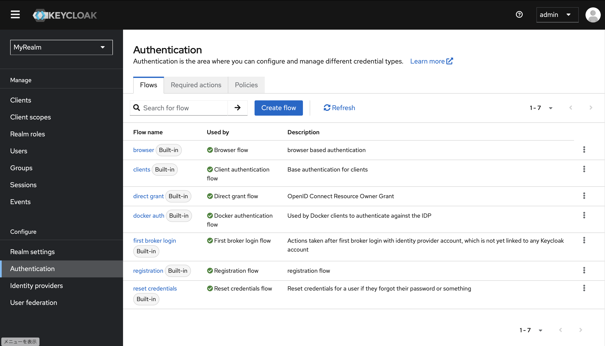
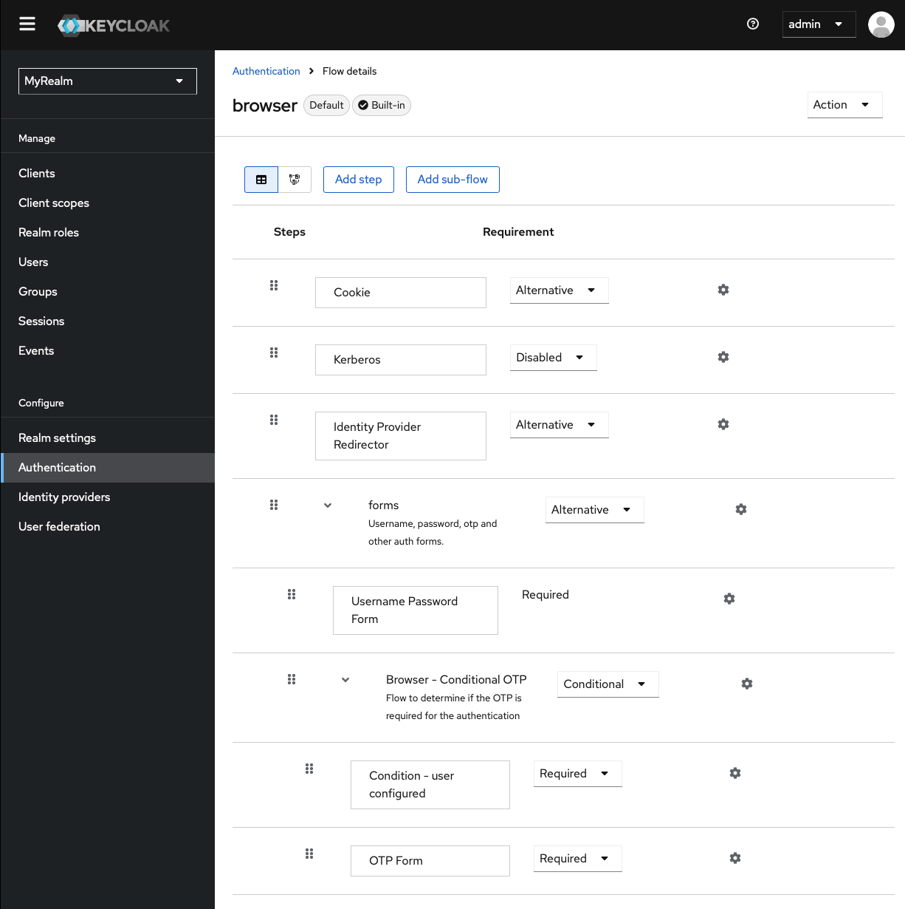

# 認証

- [この記事](https://qiita.com/l_katayose/items/1def7fb1c7595e82c225)を参考に認証について整理します。

## ビルトイン認証フロー

Keycloak の認証フローは、ユーザーがどのように認証されるかを定義するプロセスです。認証フローには複数のステップがあり、それぞれのステップでユーザーに対する認証方法や条件が決定されます。認証フローはカスタマイズ可能で、アプリケーションのニーズに合わせた柔軟な認証を実現できます。

Keycloak にはデフォルトでいくつかのビルトイン認証フローが含まれています。

- Browser flow

  - ブラウザベースの認証フローで、ユーザーがブラウザを使用して認証する際に使用されます。このフローでは、ユーザー名とパスワードの入力、2 要素認証、利用規約の同意など、様々な認証手段が統合されています。一般的な Web アプリケーションのログインに使われます。

- Client authentication flow

  - クライアント（アプリケーション）が Keycloak サーバーに対して認証する際に使用されるフローです。これはクライアントシークレットやクライアント証明書を使って、クライアント自身の認証を行うためのもので、OAuth 2.0 のクライアント認証に対応しています。

- Direct grant flow

  - リソースオーナーのパスワード認証フロー（Resource Owner Password Credentials Grant）を用いる場合に使用されます。ユーザーが直接ユーザー名とパスワードを提供し、トークンを取得するためのフローです。ブラウザを介さないバックエンドのシステムやシンプルなスクリプトからの認証に利用されます。

- Docker authentication flow

  - Docker クライアントが Keycloak を ID プロバイダーとして認証するために使用するフローです。このフローを使用することで、Docker CLI を使ってプライベートな Docker レジストリにアクセスする際に Keycloak の認証を利用できます。

- First broker login flow

  - 外部のアイデンティティプロバイダー（例えば Google や Facebook）からの認証を初めて行った場合に使用されるフローです。このフローでは、外部アカウントがまだ Keycloak のユーザーアカウントにリンクされていない場合に、ユーザーに必要なアクション（アカウントのリンクや追加情報の入力など）を要求します。

- Registration flow

  - 新規ユーザー登録のためのフローです。ユーザーが Keycloak に対して新しいアカウントを作成する際に、このフローが使用され、ユーザー名、パスワード、メールアドレスなどの入力を受け付けます。必要に応じて追加の検証（例えば、メール確認や CAPTCHA など）を含むこともできます。

- Reset credentials flow
  - ユーザーがパスワードなどの資格情報を忘れた場合に、それをリセットするためのフローです。ユーザーはメールによるリンクやセキュリティの質問などを使って、新しい資格情報を設定することができます。

## 認証タイプ

| Requirement | 意味     | 概要                                                                     | 実行後の結果                                                                                                                                         |
| ----------- | -------- | ------------------------------------------------------------------------ | ---------------------------------------------------------------------------------------------------------------------------------------------------- |
| Alternative | 代替     | 選択された「認証タイプ」が次以降の「認証タイプ」の代替をします。         | 成功すると、次の「認証タイプ」に進むことなく、認証成功となります。失敗すると、次の「認証タイプ」に進みます。                                         |
| Required    | 必須     | 選択された「認証タイプ」の成功が必要になります。                         | 成功すると、次の「認証タイプ」に進みます。失敗すると、次の「認証タイプ」に進むことなく、認証失敗となります。                                         |
| Conditional | 条件付き | 選択された「認証タイプ」はユーザ設定とその条件の可否により実行されます。 | このタイプはサブフローがある場合のみ設定され、Conditional のサブフローの評価の結果によって、Required か Disabled として動作するかが決まります。（※） |
| Disabled    | 無効     | 選択された「認証タイプ」が無効になります。                               | 実行されません。                                                                                                                                     |
