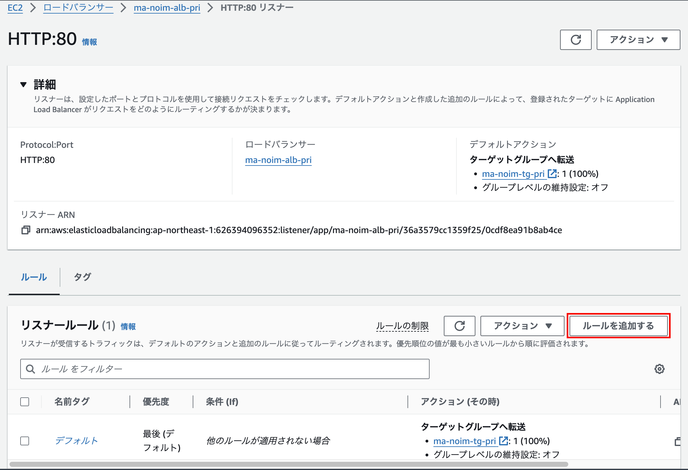

# マイクロサービス作成② （AWS環境の構築）
## 実施すること
作成したSpringBootアプリケーションを含めたコンテナをAWS上で動作させる。

アーキテクチャは以下のように作成する。


## 作成の流れ
1. VPC作成
2. ALB作成
3. コンテナのDockerHubへのプッシュ
4. ECS作成

## 1. VPC作成
VPCの要件は以下の通り。
- VPCは1つとし、CIDRは10.2.76.0/24
- Availability Zoneは2つとし、それぞれにPublic subnetとPrivate subnetを作成する
- Public subnetへはエンドユーザからからのアクセスを可能とする
- Private subnetへはインターネットからのインバウンド通信は不可とするが、Private subnet内からインターネットへのアウトバンド通信は可能とする。（Private subnetにコンテナを配置するが、コンテナレジストリはインターネット上のDocker Hubを利用するため）

VPCの構成は以下の通り。


### 1-1. VPC作成 [VPC > お使いのVPC > VPC を作成]
  - 作成するリソース：VPCのみ
  - 名前タグ：ma-noim-vpc
  - IPv4 CIDR：10.2.76.0/24

設定できたら「VPCを作成」

### 1-2. サブネット作成
[VPC > サブネット > サブネットを作成]

  - VPC ID：ma-noim-vpc
その他の設定は以下のように4つのサブネットに分割する

| サブネット名 | アベイラビリティーゾーン | IPv4 subnet CIDR block |
| ---- | ---- | ---- |
| ma-noim-subnet-pub1 | ap-northeast-1a | 10.2.76.0/26 |
| ma-noim-subnet-pub2 | ap-northeast-1c | 10.2.76.64/26 |
| ma-noim-subnet-pri1 | ap-northeast-1a | 10.2.76.128/26 |
| ma-noim-subnet-pri2 | ap-northeast-1c | 10.2.76.192/26 |

### 1-3. インターネットゲートウェイ作成
[VPC > インターネットゲートウェイ > インターネットゲートウェイの作成]

VPC内へインターネットからの通信を受け付ける、およびVPC内からインターネットへ通信を可能とするため、インターネットゲートウェイを作成する
  - 名前：ma-noim-vpc-igw

作成したらインターネットゲートウェイをVPCにアタッチする。

[VPC > インターネットゲートウェイ > VPC にアタッチ (インターネットゲートウェイID)]

  - 使用可能なVPC：ma-noim-vpc

### 1-4. Elastic IP割り当て
[VPC > Elastic IPアドレス > Elastic IPアドレスを割り当てる]

|  | プライベートサブネット a | プライベートサブネット c |
| ---- | ---- | ---- |
| ネットワークボーダーグループ | ap-northeast-1 | ap-northeast-1 |
| パブリックIPv4アドレスプール | AmazonのIPv4アドレスプール | AmazonのIPv4アドレスプール |
| タグ（任意） | Name=ma-noim-eip1 | Name=ma-noim-eip2 |

### 1-5. NATゲートウェイ作成
[VPC > NATゲートウェイ > NATゲートウェイを作成]

|  | プライベートサブネット a | プライベートサブネット c |
| ---- | ---- | ---- |
| 名前 | ma-noim-ngw1 | ma-noim-ngw2 |
| サブネット | ma-noim-subnet-pub1 | ma-noim-subnet-pub2 |
| 接続タイプ | パブリック | パブリック |
| Elastic IP | ma-noim-eip1 | ma-noim-eip2 |

接続タイプの「プライベート」はプライベートネットワークの拠点間（対オンプレなど）で使う時に使用する。

### 1-6. カスタムルートテーブル作成
[VPC > ルートテーブル > ルートテーブルを作成]

ここまで作成したサブネットはデフォルトのルートテーブルに接続されている。

デフォルトのルートテーブルはNATゲートウェイのルーティングが有効化されているプライベートサブネット向けであるため、インターネットからアクセス可能としたいパブリックサブネットは、インターネットゲーウェイのルーティングが有効化されているカスタムルートテーブルに紐づける必要がある。

まずは、カスタムルートテーブルを作成する。
  - 名前：ma-noim-rtb-pub
  - VPC：ma-noim-vpc

カスタムルートテーブルをサブネットに紐づける。[VPC > ルートテーブル > rtb-ID > サブネットの関連付けを編集]
  - 関連付け対象①：ma-noim-subnet-pub1
  - 関連付け対象②：ma-noim-subnet-pub2

サブネット向けのルートテーブルは、デフォルトのものを利用する事とする。

### 1-7. カスタムルートテーブルにルートを追加
[VPC > ルートテーブル > rtb-ID > ルートを編集]

igwの作成ができたら、ルートテーブルの設定を開き、ルートを追加する
  - 送信先：0.0.0.0/0
  - ターゲット：ma-noim-vpc-igwのインターネットゲートウェイID


|   | ma-noim-rtb-pub |
| ---- | ---- |
| ルート | 送信先：0.0.0.0/0 → ターゲット：ma-noim-igw |
| ルート | 送信先：10.2.76.0/24 → ターゲット：local |
| サブネットの関連付け | ma-noim-subnet-pub1, ma-noim-subnet-pub2 |


|   | ma-noim-rtb-pri1 |
| ---- | ---- |
| ルート | 送信先：0.0.0.0/0 → ターゲット：ma-noim-ngw1 |
| ルート | 送信先：10.2.76.0/24 → ターゲット：local |
| サブネットの関連付け | ma-noim-subnet-pri1 |

|   | ma-noim-rtb-pri2 |
| ---- | ---- |
| ルート | 送信先：0.0.0.0/0 → ターゲット：ma-noim-ngw2 |
| ルート | 送信先：10.2.76.0/24 → ターゲット：local |
| サブネットの関連付け | ma-noim-subnet-pri2 |


## 2. ALB作成
インターネットからフロントエンドへのアクセスだけでなく、フロントエンドからバックエンドへのアクセスもHTTPを利用した構成であるため、ロードバランサにはアプリケーションロードバランサ（ALB）を利用する。また、パブリックサブネットへのアクセスとプライベートサブネットへのアクセスはアクセス元を制御する（プライベートサブネットへはインターネットからの通信を遮断）必要があるので、publicとprivateはそれぞれ別のALBを用意して、セキュリティグループにてアクセス制御を実施する。

### 2-1. セキュリティグループ作成
[EC2 > セキュリティグループ > セキュリティグループを作成]

それぞれのALBに適用するセキュリティグループ（通信制御）を作成しておく

|  | パブリックサブネット | プライベートサブネット |
| ---- | ---- | ---- |
| セキュリティグループ名 | ma-noim-sg-pub | ma-noim-sg-pri |
| 説明（任意） | Internet to public subnet | Internal VPC to private subnet |
| VPC | ma-noim-vpc | ma-noim-vpc |
| インバウンドルール（プロトコル）| HTTP/80 | 全てのトラフィック |
| インバウンドルール（送信元） | 0.0.0.0/0 | 10.2.76.0/24 |
| タグ（任意） | Name=ma-noim-sg-pub | Name=ma-noim-sg-pri |

パブリックALBには、全ての送信元からのHTTP通信のみを許可。プライベートALBには、VPC内の送信元からのみHTTP通信を許可。

### 2-2. ターゲットグループ
[EC2 > ターゲットグループ > ターゲットグループの作成]

ALBで負荷分散された後に転送先となるターゲットグループを作成する。

ECSで起動タイプでFargateを利用する場合はターゲットタイプは「IPアドレス」。起動タイプをインスタンスとするならば「インスタンス」。

|  | パブリックサブネット | プライベートサブネット |
| ---- | ---- | ---- |
| ターゲットタイプ | IPアドレス | IPアドレス |
| ターゲットグループ名 | ma-noim-tg-pub | ma-noim-tg-backend-item |
| プロトコル/ポート| HTTP/80 | HTTP/80 |
| VPC | ma-noim-vpc | ma-noim-vpc |
| ヘルスチェク | /login.html | /backend-item/items |

ターゲットを登録する画面は、後にECSサービスを作成する時に指定する（ECSサービス作成時にALBおよびターゲットグループを選択することで、自動で登録される）のでデフォルトのままで作成する。

### 2-3. ALB作成
[EC2 > ロードバランサー > ロードバランサータイプの比較と選択]

まずはALBを作成して、リスナー（どのポートで受け付けて、どこに転送するか）を設定する。

|  | パブリックサブネット | プライベートサブネット |
| ---- | ---- | ---- |
| ロードバランサータイプ | Application Load Balancer | Application Load Balancer |
| ロードバランサー名 | ma-noim-alb-pub | ma-noim-alb-pri |
| スキーム | インターネット向け | 内部 |
| VPC | ma-noim-vpc | ma-noim-vpc |
| マッピング | ma-noim-subnet-pub1, ma-noim-subnet-pub2 | ma-noim-subnet-pri1, ma-noim-subnet-pri2 |
| セキュリティグループ | ma-noim-sg-pub | ma-noim-sg-pri |
| リスナー（プロトコル/ポート）| HTTP/80 | HTTP/80 |
| リスナー（転送先） | ma-noim-tg-pub | ma-noim-tg-backend-item |
後の設定はデフォルトのまま。

例として、パブリック向けALBの設定は以下のようになる。


### 2-4. パスベースのルーティング設定
[EC2 > ロードバランサー > ma-noim-tg-backend-item > HTTP:80 リスナー]

プライベートサブネットへの転送はパスベースルーティングを利用する。パスベースルーティングを利用することで、「/backend-item/を含むURLはターゲットグループAへ転送する。/backend-xxx/を含むURLはターゲットグループBへ転送する」といったことが可能となる。

パスベースルーティングの設定は作成したリスナーのルールで設定する。



- [ルールを追加] Name：backend-item
- [ルール条件の定義] ルールの条件タイプ：パス = /backend-item/*


- [ルールアクションの定義] アクションの種類：ターゲットグループへ転送
- [ルールアクションの定義] ターゲットグループ：ma-noim-tg-backend-item
- [ルールの優先度] 優先度：1（デフォルトルールより優先されていればOK）


### 2-5. ALBのFQDNをアプリケーション構成情報に反映
作成できたALBに割り当てられたFQDNを確認する。


つまり、以下のような経路で動作する事となる。


フロントエンドからバックエンドを呼び出す時の構成情報を修正する。
```{code-block} yaml
:caption: 【frontend-webapp】/resources/application.yml
:emphasize-lines: 2

service:
    backendEndpoint: http://internal-ma-noim-alb-pri-1627874572.ap-northeast-1.elb.amazonaws.com
```
## 3. コンテナプッシュ
[GitHubActionsを利用した自動ビルド](https://noimasaki.github.io/noimemo/GitHubAction_DockerPush.html)を参照して、DockerHubへコンテナをアップロードする。次の手順ではECSにてDockerHubからコンテナをダウンロードしてECSタスクを定義する。

## 4. ECS作成
https://dev.classmethod.jp/articles/divide-clusters-in-aws-fargate/


### 4-1. ECSクラスタ作成
[Amazon Elastic Container Service > クラスターの作成]

|  | パブリックサブネット | プライベートサブネット |
| ---- | ---- | ---- |
| クラスタ名 | ma-noim-ecs-cluster-frontend | ma-noim-ecs-cluster-backend-item |
| インフラストラクチャ | AWS Fargate | AWS Fargate |

|  | パブリックサブネット | プライベートサブネット |
| ---- | ---- | ---- |
| クラスタ名 | ma-noim-ecs-cluster-frontend | ma-noim-ecs-cluster-backend-item |
| インフラストラクチャ | AWS Fargate | AWS Fargate |


### 4-2. ECSタスク定義
[Amazon Elastic Container Service > 新しいタスク定義の作成]

 - タスク定義ファミリー：ma-noim-ecs-task-frontend
 - 起動タイプ：AWS Fargate
 - タスクロール：なし（AWSのサービスを利用する場合は適したIAMロールを作成して適用）
 - コンテナ 名前：frontend-webapp
 - コンテナ イメージ：noimasaki/frontend-webapp
 - コンテナ 必須コンテナ：はい
 - コンテナ コンテナポート：8080
 - コンテナ プロトコル：TCP
 - ログ収集：有効


 - タスク定義ファミリー：ma-noim-ecs-task-backend-item
 - 起動タイプ：AWS Fargate
 - タスクロール：なし（AWSのサービスを利用する場合は適したIAMロールを作成して適用）
 - コンテナ 名前：backend-item
 - コンテナ イメージ：noimasaki/backend-item
 - コンテナ 必須コンテナ：はい
 - コンテナ コンテナポート：8080
 - コンテナ プロトコル：TCP
 - ログ収集：有効


### 4-3. ECSサービス定義
[Amazon Elastic Container Service > クラスター > 【クラスターID】 > サービスの作成]

 - アプリケーションタイプ：サービス
 - ファミリー：ma-noim-ecs-task-frontend
 - サービス名：ma-noim-ecs-service-frontend
 - VPC：ma-noim-vpc
 - サブネット：ma-noim-subnet-pub1, ma-noim-subnet-pub2
 - セキュリティグループ：ma-noim-sg-pub
 - パブリックIP：有効
 - ロードバランサー：ma-noim-alb-pub
 - ロードバランサー ヘルスチェックの猶予期間：60秒
 - リスナー：80:HTTP
 - ターゲットグループ：ma-noim-tg-pub


 - アプリケーションタイプ：サービス
 - ファミリー：ma-noim-ecs-task-backend-item
 - サービス名：ma-noim-ecs-service-backend-item
 - VPC：ma-noim-vpc
 - サブネット：ma-noim-subnet-pri1, ma-noim-subnet-pri2
 - セキュリティグループ：ma-noim-sg-pri
 - パブリックIP：無効
 - ロードバランサー：ma-noim-alb-pri
 - ロードバランサー ヘルスチェックの猶予期間：60秒
 - リスナー：80:HTTP
 - ターゲットグループ：ma-noim-tg-backend-item

backend-itemのタスクのステータスが「保留中」のままの場合、DockerHubからコンテナをプルできていない可能性がある。ネットワーク設定を確認し、プライベートサブネットからインターネットへの疎通性があるかどうか確認すること。