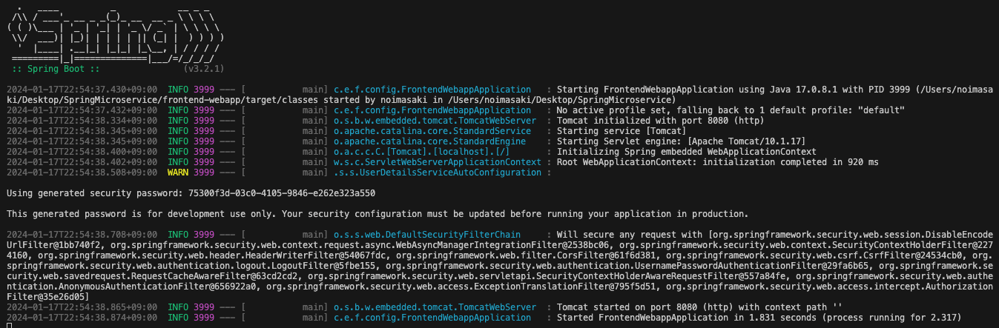
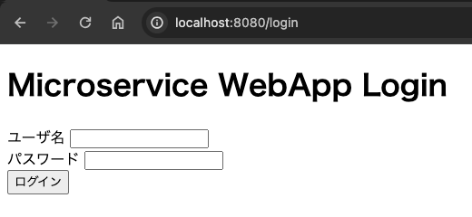
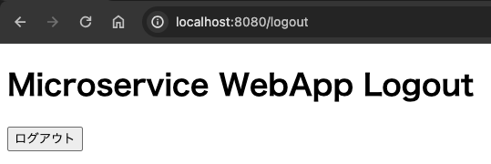

# マイクロサービス作成①　（ローカル環境での開発）
## 実施すること
認証認可機能と画面表示機能を持ったフロントエンドサービスと、商品情報のCRUD操作のAPIを提供するバックエンドサービスを作成する。

ユーザはブラウザからFrontendにアクセスし、認証成功後にBackendにアクセスすることができる。



## 作成の流れ
1. バックエンド作成
2. フロントエンド作成
3. フロントエンド→バックエンド呼び出し
4. コンテナ化

## 1. バックエンド作成
フロントから呼び出されるバックエンドを作成する。商品情報の参照、登録、更新、削除のREST APIを提供する。ただし、まずは商品情報参照機能のみを提供し、その他の機能は別途追加する。

### 1-1. プロジェクト作成（Spring Initializr）
- SpringBoot: 3.2.2
- GroupId: com.example（デフォルト）
- ArtifactId: backend-item
- Packaging type: Jar
- Java version: 17
- dependencies: Spring Web（spring-boot-starter-web）

### 1-2. ディレクトリ構成変更
```bash
SpringMicroservice/backend-item/src/main
├── java/com/example
│   └── backenditem
│       ├── BackendItemApplication.java # 起動クラス
│       ├── app                         # アプリケーション層
│       │   └── ItemController.java
│       ├── config                      # 各種Spring設定クラスを配置
│       └── domain                      # ドメイン層
│           ├── ItemModel.java
│           └── ItemService.java
└── resources
    ├── application.yml # アプリケーション設定ファイル
    ├── static          # 静的リソース（CSS、JavaScript、画像など）
    └── templates       # テンプレート（html）
        ├── home.html
        ├── login.html
        └── logout.html
```

### 1-3. モデル作成
商品情報のモデルを作成する。

Getter・Setterおよびコンストラクタは、VS codeの補完機能を使うと自動で作成が可能。右クリックから`ソースアクション > Generate Getters and Setters...`と`ソースアクション > Generate Constructors...`を選択。

```{code-block} java
:caption: domain/Item.java

package com.example.backenditem.domain;

public class Item {
    private String itemId;          //商品ID
    private String itemName;        //商品名
    private String itemCategory;    //商品カテゴリー

    // コンストラクタ
    public Item(String itemId, String itemName, String itemCategory) {
        this.itemId = itemId;
        this.itemName = itemName;
        this.itemCategory = itemCategory;
    }

    // GetterおよびSetter
    public String getItemId() {
        return itemId;
    }

    public void setItemId(String itemId) {
        this.itemId = itemId;
    }

    public String getItemName() {
        return itemName;
    }

    public void setItemName(String itemName) {
        this.itemName = itemName;
    }

    public String getItemCategory() {
        return itemCategory;
    }

    public void setItemCategory(String itemCategory) {
        this.itemCategory = itemCategory;
    }
    
}

```

### 1-4. サービス作成
コントローラから呼ばれるビジネスロジックであるサービスクラスを作成する。
なお、ここでは前述の通り、参照機能のみをまずは実装する。

```{code-block} java
:caption: domain/ItemService.java

package com.example.backenditem.domain;

import java.util.Arrays;
import java.util.List;

import org.springframework.stereotype.Service;

@Service
public class ItemService {
    private List<Item> allItems = Arrays.asList(
        new Item("10001", "ネックレス", "ジュエリ"),
        new Item("10002", "パーカー", "ファッション"),
        new Item("10003", "フェイスクリーム", "ビューティ"),
        new Item("10004", "サプリメント", "ヘルス"),
        new Item("10005", "ブルーベリー", "フード")
    );

    // 全てのItemリストを返すメソッド
    public List<Item> getAllItems() {
        return allItems;
    }

    // 個別のItemを返すメソッド
    public Item getItem(String itemId) {
        for (int i=0; i<allItems.size(); i++){
            if (allItems.get(i).getItemId().equals(itemId)) {
                return allItems.get(i);
            }
        }
        return null;    // itemIdが見つからなかったらnullを返す
    }

}
```

### 1-5. コントローラ作成
```{code-block} java
:caption: app/ItemController.java

package com.example.backenditem.app;

import java.util.List;

import org.springframework.beans.factory.annotation.Autowired;
import org.springframework.web.bind.annotation.GetMapping;
import org.springframework.web.bind.annotation.PathVariable;
import org.springframework.web.bind.annotation.RestController;

import com.example.backenditem.domain.Item;
import com.example.backenditem.domain.ItemService;

@RestController
public class ItemController {
    @Autowired
    private ItemService itemService;

    // 全てのItem情報を返す
    // http://<ホスト名>:<ポート番号>/
    @GetMapping("/items")
    public List<Item> getAllItems(){
        return itemService.getAllItems();
    }

    // 個別のItem情報を返す
    // http://<ホスト名>:<ポート番号>/{商品ID}
    @GetMapping("/items/{itemId}")
    public Item getItem(@PathVariable("itemId") String itemId){
        return itemService.getItem(itemId);
    }

}
```

### 1-6. アプリケーションプロパティの設定
アプリケーションの構成情報（DB接続情報・サーバ設定・ログ設定など）をJavaファイルとは別のところに記載することで、ソースファイルにハードコーディングすることなく動作を変更することが可能となる。

今回は、バックエンドサービスのコンテキストパスを指定する。以下を指定することで、待ち受けるURLもこれまで`http://localhost:8080/item`だったのが`http://localhost:8080/backend-items/item`となる。

```{code-block} yaml
:caption: 【backend-item】/resources/application.yml

server:
  servlet:
   context-path: /backend-item
  port: 8080
```

コンテキストパスをマイクロサービス毎に変えることで、AWSのALBのパスルーティングで適したマイクロサービスにルーティングすることができる。

### 1-7. 動作確認
バックエンド単体の動作確認を実施する。

[http://localhost:8080/backend-item/items](http://localhost:8080/backend-item/items)へアクセスして、全ての商品情報を取得できること。


## 2. フロントエンド作成
### 2-1. プロジェクト作成（Spring Initializr）
- SpringBoot: 3.2.2
- GroupId: com.example（デフォルト）
- ArtifactId: frontend-webapp
- Packaging type: Jar
- Java version: 17
- dependencies: Spring Web（spring-boot-starter-web）
- dependencies: Spring Reactive Web（spring-boot-starter-webflux）
- dependencies: Spring Security（spring-boot-starter-security）
- dependencies: Thymeleaf（spring-boot-starter-thymeleaf）

### 2-2. ディレクトリ構成変更
可読性向上の為、`.java`が含まれるディレクトリを以下のように変更する。今後作成するファイルを含めて以下のような構成となる。

```bash
SpringMicroservice/frontend-webapp/src/main
├── java/com/example
│   └── frontendwebapp
│       ├── FrontendWebappApplication.java  # 起動クラス
│       ├── app                             # アプリケーション層
│       │   └── frontController.java
│       ├── config                          # 各種Spring設定クラスを配置
│       │   ├── SecurityConfig.java
│       │   └── WebClientConfig.java
│       └── domain                          # ドメイン層
│           └── itemService.java
└── resources
    ├── application.yml # アプリケーション設定ファイル
    ├── static          # 静的リソース（CSS、JavaScript、画像など）
    └── templates       # テンプレート（html）
        ├── home.html
        ├── login.html
        └── logout.html
```

SpringBootでは`@Controller`や`@Service`がついたクラスを自動で認識する。しかし、起動クラスが配置されたディレクトリ配下のみが認識対象である。例えば、config配下に起動クラスを配置した場合には`@ComponentScan`を利用して、スキャン対象のディレクトリを明示的に指定する必要がある。


### 2-3. `.html`作成
フロントエンドは画面を生成してクライアントに返す役割があるため、各種htmlを作成する。画面作成にあたって、Thymeleafを利用する。

ログインページ
```{code-block} html
:caption: resources/templates/login.html

<!DOCTYPE html>
<!-- Thymeleafを有効化 => th:XXXX という属性を各タグに追加することで利用可能 -->
<html xmlns:th="http://www.thymeleaf.org">
<head>
    <title>ログインページ</title>
</head>
<body>
    <h1>Microservice WebApp Login</h1>

    <!-- URLパラメータに「error」が含まれていたら、メッセージ出力 -->
    <div th:if="${param.error}">
        <p>ユーザー名もしくはパスワードが違います</p>
    </div>

    <!-- ユーザ名・PWをサーバへ送信するためのForm -->
    <!-- submitボタンが押下された時のaction（URLパス`/login`へ`post`する）※@はthのリンク記法 -->
    <!-- `action="#" はThymleafが有効化されていれば上書きされる -->
    <form action="#" th:action="@{/login}" method="post">
        <div>
            <label for="usernameInput">ユーザ名</label>
            <input type="text" id="usernameInput" name="username">
            <!-- name="username"はSecurityConfig.javaにてフィールド名指定を合わせる必要がある -->
        </div>
        <div>
            <label for="passwordInput">パスワード</label>
            <input type="password" id="passwordInput" name="password">
            <!-- name="password"はSecurityConfig.javaにてフィールド名指定を合わせる必要がある -->
        </div>
        <div>
            <button type="submit">ログイン</button>
        </div>
    </form>
</body>
</html>
```

ログイン後に表示されるホームページ
```{code-block} html
:caption: resources/templates/home.html

<!DOCTYPE html>
<html xmlns:th="http://www.thymeleaf.org">
<head>
    <title>Welcomeページ</title>
</head>
<body>
    <div>Successful Login!</div>

    <ul>
        <li><a href="./items.html" th:href="@{/items}">商品一覧</a></li>
    </ul>
    <ul>
        <li><a href="./logout.html" th:href="@{/logout}">ログアウト</a></li>
    </ul>
</body>
</html>
```

ログアウトページ
```{code-block} html
:caption: resources/templates/logout.html

<!DOCTYPE html>
<html xmlns:th="http://www.thymeleaf.org">
<head>
    <title>ログアウトページ</title>
</head>
<body>
    <h1>Microservice WebApp Logout</h1>
    <form action="#" th:action="@{/logout}" method="post">
        <div>
            <button type="submit">ログアウト</button>
        </div>
    </form>
</body>
</html>
```

### 2-4. アプリケーションプロパティの設定
今回、バックエンドへアクセスするときのエンドポイント情報（FQDN）を記載する。本アプリケーションは最終的にコンテナ化してAWS上で動作させるが、バックエンドはALBを利用してフロントエンドからアクセスするため、プロパティファイルから読みだす構成とする。

SpringInitializerでは`application.properties`が作成されるが、yaml形式で記載するため、ファイルをリネームして以下を記載する。

```
service:{code-block} yaml
:caption: resources/application.yml

    # backendEndpoint: http://localhost:8081
    backendEndpoint: http://【バックエンドECSクラスターへ負荷分散するALBのFQDN】
```

### 2-5. `WebClientConfig.java`作成
フロントエンドからバックエンドAPIを呼び出す時は、Spring WebFluxに内包されているHTTPクライアントである「WebClient」を利用する。

```{code-block} java
:caption: config/WebClientConfig.java

package com.example.frontendwebapp.config;

import org.springframework.beans.factory.annotation.Value;
import org.springframework.context.annotation.Bean;
import org.springframework.context.annotation.Configuration;
import org.springframework.web.reactive.function.client.WebClient;

@Configuration
public class WebClientConfig {

    // application.ymlからプロパティservice.backendEndpointの値を取得して
    // 変数backendEndpointへ設定する
    @Value("${service.backendEndpoint}")
    private String backendEndpoint;
    
    // backendを呼び出すときの基本URIを設定
    // つまり、「/backend/items」へリクエストを送信するときに
    // 基本URIを設定して「http://xxxx.com/backend/items」へリクエストを送信する
    @Bean
    public WebClient webClient(){
        return WebClient.builder()
                .baseUrl(backendEndpoint)
                .build();
    }

}
```

### 2-6. バックエンド呼び出し用サービスクラス作成
WebClientを利用して、backend-itemを呼び出すサービスクラスを作成
```{code-block} java
:caption: domain/itemService.java

package com.example.frontendwebapp.domain;

import org.springframework.beans.factory.annotation.Autowired;
import org.springframework.stereotype.Service;
import org.springframework.web.reactive.function.client.WebClient;

@Service
public class itemService {
    @Autowired
    WebClient webClient;

    public String getAllItems(){
        return webClient.get()
                .uri("/backend-item/items")
                .retrieve()                 // retrieveの後にレスポンスを抽出する方法を記述する
                .bodyToMono(String.class)   // String型で受け取る
                .block();                   // ブロッキング
    }
}
```


### 2-7. `frontController.java`作成
@GetMappingを利用して特定のパスへのGET時に、Thymeleafによりテンプレートから生成されたhtmlを返すコントローラを作成する。

```{code-block} java
:caption: app/frontController.java

package com.example.frontendwebapp.app;

import org.springframework.beans.factory.annotation.Autowired;
import org.springframework.stereotype.Controller;
import org.springframework.web.bind.annotation.GetMapping;
import org.springframework.web.bind.annotation.ResponseBody;

import com.example.frontendwebapp.domain.itemService;

@Controller
public class frontController {

    // 引数なしの場合はアプリケーションのコンテキストルート
    // http://<ホスト名>:<ポート番号>/ へのGET時に呼び出される
    @GetMapping
    public String home(){
        return "home";      // home.htmlをreturn
    }

    // http://<ホスト名>:<ポート番号>/login
    @GetMapping("/login")
    public String login(){
        return "login";     // login.htmlをreturn
    }

    // http://<ホスト名>:<ポート番号>/logout
    @GetMapping("/logout")
    public String logout(){
        return "logout";    // logout.htmlをreturn
    }

    // backend-item呼び出し
    // http://<ホスト名>:<ポート番号>/items
    @Autowired
    private itemService itemService;

    @GetMapping("/items")
    @ResponseBody
    public String items(){
        // @ResponseBodyアノテーションにより、バックエンドから返却した戻り値をそのまま文字情報としてreturn
        return itemService.getAllItems();
    }

}
```

Thymeleafを利用しているため、Stringでreturnしてしまうとhtmlファイル名であると解釈してしまうため、htmlファイルではなくてレスポンス本文であることを明示的にする@ResponseBodyアノテーションを付与する。


### 2-8. `SecurityConfig.java`作成
SpringSecurityの挙動をカスタムする

```{code-block} java
:caption: config/SecurityConfig.java

package com.example.frontendwebapp.config;

import org.springframework.context.annotation.Bean;
import org.springframework.context.annotation.Configuration;
import org.springframework.security.config.annotation.web.builders.HttpSecurity;
import org.springframework.security.config.annotation.web.configuration.EnableWebSecurity;
import org.springframework.security.web.SecurityFilterChain;

@Configuration
@EnableWebSecurity
public class SecurityConfig {
    
    @Bean
    protected SecurityFilterChain configure(HttpSecurity http) throws Exception {
        http
            .authorizeHttpRequests((requests) -> requests
            .requestMatchers("/login/*").permitAll()    // "/login"は認証不要
            .anyRequest().authenticated()               // その他のリクエストは認証が必要
            )
            .formLogin((form) -> form   // 認証方式はformログイン
            .loginPage("/login")    // 認証ページは"/login"
            .permitAll()
            )
            .logout((logout) -> logout.permitAll());    // ログアウト機能を有効化し、すべてのユーザがログアウト可能
        
            return http.build();
    }
    
}
```

### 2-9. 動作確認
ここまで作成することで、認証認可機能を持ったフロントエンドが動作する。



ログイン画面



ログイン成功→ホームページが表示


ログアウトリンク押下→ログアウト画面



ID/PWが異なる場合にはログイン出来ずにメッセージ出力される


## 3. フロント→バックエンド呼び出し
ここまでの実装で、フロントエンドからバックエンドを呼び出すことが可能となっており、最終的なAWS環境では下記のように動作する。


