ログ出力を試す
####################

.. image:: ./_static/Microservice_Logging/architecture.drawio.svg

ログサーバ用コンテナの準備
==========================
まず、ローカル検証環境で準備する。

ローカル検証環境で、fluent.confを作成して、fluentdの設定ファイルを作成する。

.. code-block::

    <source>
    @type http
    port 9880
    bind 0.0.0.0
    </source>

    <match **>
    @type stdout
    </match>

fluentdの最新コンテナイメージを利用して、コンテナを起動する。

.. code-block::

    # コンテナ起動
    podman run -d --name fluentd -p 9880:9880 -v .:/fluentd/etc -e FLUENTD_CONF=fluent.conf fluent/fluentd:edge

    # テストログ送信
    curl -X POST -d 'json={"action":"test","user":"example"}' http://localhost:9880/sample.log

    # ログ確認
    [noim@rhel9 test_fluentd]$ podman logs fluentd
    2024-02-18 15:30:12 +0000 [info]: init supervisor logger path=nil rotate_age=nil rotate_size=nil
    2024-02-18 15:30:12 +0000 [info]: parsing config file is succeeded path="/fluentd/etc/fluent.conf"
    2024-02-18 15:30:12 +0000 [info]: gem 'fluentd' version '1.16.3'
    2024-02-18 15:30:12 +0000 [warn]: define <match fluent.**> to capture fluentd logs in top level is deprecated. Use <label @FLUENT_LOG> instead
    2024-02-18 15:30:12 +0000 [info]: using configuration file: <ROOT>
    <source>
        @type http
        port 9880
        bind "0.0.0.0"
    </source>
    <match **>
        @type stdout
    </match>
    </ROOT>
    2024-02-18 15:30:12 +0000 [info]: starting fluentd-1.16.3 pid=2 ruby="3.2.2"
    2024-02-18 15:30:12 +0000 [info]: spawn command to main:  cmdline=["/usr/bin/ruby", "-Eascii-8bit:ascii-8bit", "/usr/bin/fluentd", "--config", "/fluentd/etc/fluent.conf", "--plugin", "/fluentd/plugins", "--under-supervisor"]
    2024-02-18 15:30:13 +0000 [info]: #0 init worker0 logger path=nil rotate_age=nil rotate_size=nil
    2024-02-18 15:30:13 +0000 [info]: adding match pattern="**" type="stdout"
    2024-02-18 15:30:13 +0000 [info]: adding source type="http"
    2024-02-18 15:30:13 +0000 [warn]: #0 define <match fluent.**> to capture fluentd logs in top level is deprecated. Use <label @FLUENT_LOG> instead
    2024-02-18 15:30:13 +0000 [info]: #0 starting fluentd worker pid=11 ppid=2 worker=0
    2024-02-18 15:30:13 +0000 [info]: #0 fluentd worker is now running worker=0
    2024-02-18 15:30:13.192837127 +0000 fluent.info: {"pid":11,"ppid":2,"worker":0,"message":"starting fluentd worker pid=11 ppid=2 worker=0"}
    2024-02-18 15:30:13.193745831 +0000 fluent.info: {"worker":0,"message":"fluentd worker is now running worker=0"}
    2024-02-18 15:31:03.719726481 +0000 sample.log: {"action":"test","user":"example"}

アクセスログ実装
=================================
アクセスログを実装して標準出力に出力させる。

.. code-block:: java
    :linenos:
    :emphasize-lines: 3-4, 15-18, 24-25

    package com.example.frontendwebapp.app;

    import org.slf4j.Logger;
    import org.slf4j.LoggerFactory;
    import org.springframework.beans.factory.annotation.Autowired;
    import org.springframework.stereotype.Controller;
    import org.springframework.web.bind.annotation.GetMapping;
    import org.springframework.web.bind.annotation.ResponseBody;

    import com.example.frontendwebapp.domain.itemService;

    @Controller
    public class frontController {

        // Logger生成
        // getLoggerの引数にClassオブジェクトを指定するとロガー名はそのクラスのFQDNとなる
        private static final Logger logger = LoggerFactory
            .getLogger(frontController.class);

        // 引数なしの場合はアプリケーションのコンテキストルート
        // http://<ホスト名>:<ポート番号>/ へのGET時に呼び出される
        @GetMapping
        public String home(){
            // ログ出力
            logger.info("アクセスログ");

            return "home";      // home.htmlをreturn
        }

        // 省略..

    }

Springを起動して、ログイン後、アクセスログが出力されていることを確認する。

ただ、アクセスログで言えば送信元のIPアドレスや、ログインユーザ名も知りたいところだが、それらを実装していくと本来のControllerとしてのコードが見づらくなってしまう。そこで、SpringBootではAOPを利用してログ出力する。

シンプルな記述例としては以下となる。これは、ログを出力したいController側には何もコードを記述する必要がなく、frontController内の各メソッドが呼び出された後（After）にログが出力される。

.. code-block:: java

    package com.example.frontendwebapp.app;

    import org.aspectj.lang.JoinPoint;
    import org.aspectj.lang.annotation.After;
    import org.aspectj.lang.annotation.Aspect;
    import org.slf4j.Logger;
    import org.slf4j.LoggerFactory;
    import org.springframework.stereotype.Component;

    @Aspect
    @Component
    public class loggingAspect {
        
        private static final Logger logger = LoggerFactory.getLogger(loggingAspect.class);

        @After("within(com.example.frontendwebapp.app.frontController)")
        public void logAfterReturning(JoinPoint joinPoint) {
            // メソッド実行後のログ出力
            logger.info("after: メソッド {} が正常に実行されました。", joinPoint.getSignature().getName());
        }
        
    }

その他、アクセス元IPやユーザ情報を追記したものは下記。

.. code-block:: java

    package com.example.frontendwebapp.aspect;

    import java.net.InetAddress;
    import java.net.UnknownHostException;

    import org.aspectj.lang.JoinPoint;
    import org.aspectj.lang.annotation.After;
    import org.aspectj.lang.annotation.Aspect;
    import org.slf4j.Logger;
    import org.slf4j.LoggerFactory;
    import org.springframework.beans.factory.annotation.Autowired;
    import org.springframework.security.core.Authentication;
    import org.springframework.security.core.context.SecurityContextHolder;
    import org.springframework.stereotype.Component;
    import org.springframework.web.context.request.RequestContextHolder;
    import org.springframework.web.context.request.ServletRequestAttributes;

    import jakarta.servlet.http.HttpServletRequest;

    @Aspect
    @Component
    public class LoggingAspect {
        
        private static final Logger logger = LoggerFactory.getLogger(LoggingAspect.class);

        @Autowired
        private HttpServletRequest request;

        @After("within(com.example.frontendwebapp.app.frontController)")
        public void logAfterReturning(JoinPoint joinPoint) {
            // ログ要素
            String ipAddress = request.getRemoteAddr();
            String method = joinPoint.getSignature().getName();
            String userId = getUserId();
            String host = getServerName();
            String sessionId = getSessionId();

            // ログのフォーマット
            String logMessage = String.format("Method: %s, IP: %s, User: %s, Host: %s, SessionId: %s", method , ipAddress, userId, host, sessionId);

            // メソッド実行後のログ出力
            logger.info(logMessage);
        }
        
        private String getUserId() {
            Authentication authentication = SecurityContextHolder.getContext().getAuthentication();
            return (authentication != null) ? authentication.getName() : "Anonymous";
        }

        private String getServerName() {
            try {
                return InetAddress.getLocalHost().getHostName();
            } catch (UnknownHostException e) {
                return "Unknown";
            }
        }

        private String getSessionId() {
            return RequestContextHolder.getRequestAttributes() instanceof ServletRequestAttributes
                    ? ((ServletRequestAttributes) RequestContextHolder.getRequestAttributes()).getRequest().getSession().getId()
                    : "No session";
        }
    }

トラッキングID
================================================
マイクロサービスアーキテクチャでは、複数のマイクロサービスが連携して処理を実行する為、処理のトレースを可視化することが重要である。

そこで、各処理毎にトレースを可能とするIDを付与してログ出力する。

(a) フロントエンド
------------------------------
トラッキングIDを生成して、バックエンドにたいしてHTTPリクエストヘッダーに`X-Tracking-ID`というヘッダー名でリクエストを投げる

.. code-block:: java
    :linenos:
    :emphasize-lines: 15-17, 21

    package com.example.frontendwebapp.domain;

    import java.util.UUID;

    import org.springframework.beans.factory.annotation.Autowired;
    import org.springframework.stereotype.Service;
    import org.springframework.web.reactive.function.client.WebClient;

    @Service
    public class itemService {
        @Autowired
        WebClient webClient;

        public String getAllItems(){
            // トラッキングID生成
            String trackingId;
            trackingId = UUID.randomUUID().toString();

            return webClient.get()
                    .uri("/backend-item/items")
                    .header("X-Tracking-ID", trackingId)    // ヘッダーにトラッキングIDを設定
                    .retrieve()                 // retrieveの後にレスポンスを抽出する方法を記述する
                    .bodyToMono(String.class)   // String型で受け取る
                    .block();                   // ブロッキング
        }
    }

(b) バックエンド
------------------------------
フロントエンドから受信したHTTPリクエストからトラックIDを取得して、ログに出力する。

.. code-block:: java
    :linenos:

    package com.example.backenditem.app;

    import org.slf4j.Logger;
    import org.slf4j.LoggerFactory;
    import org.springframework.stereotype.Component;
    import org.springframework.web.servlet.HandlerInterceptor;

    import jakarta.servlet.http.HttpServletRequest;
    import jakarta.servlet.http.HttpServletResponse;

    @Component
    public class TrackingInterceptor implements HandlerInterceptor{

        private static final Logger logger = LoggerFactory.getLogger(TrackingInterceptor.class);

        @Override
        public boolean preHandle(HttpServletRequest request, HttpServletResponse response, Object handler) throws Exception {
            // リクエストヘッダーからトラッキングIDを取得
            String trackingId = request.getHeader("X-Tracking-ID");

            // トラッキングIDが存在する場合、それをログに記録
            if (trackingId != null) {
                logger.info("Handling request with Tracking ID: {}", trackingId);
            } else {
                logger.info("Handling request without Tracking ID");
            }

            return true;
        }
        
    }

ログドライバーを利用する。
================================

ロギングドライバーを利用してS3にログを転送する
==============================================
1. S3バケット作成（ma-noim-bucket）
2. ロールの作成
    - 信頼されたエンティティタイプ：AWSのサービス
    - ユースケース：Elastic Container Service Task
    - 許可ポリシー：AmazonECSTaskExecutionRolePolicy
    - 許可ポリシー：AmazonS3FullAccess
    - ロール名：ma-noim-role-ecs
3. 新しいタスク定義
    - 基本はこれまでのコピー
    - ログ収集の使用：AWS FireLens 経由でS3にログをエクスポートする
        Name：S3（デフォルト）
        region：ap-northeast-1（デフォルト）
        bucket：ma-noim-bucket
        total_file_size：1M（デフォルト）
        upload_timeout：1m（デフォルト）
        use_put_object：On（デフォルト）
4. サービスのデプロイ
    - 新しいデプロイの強制にチェックをつけて、デプロイする

FilterでX-IDを生成する。
===================================================

.. code-block:: java

    package com.example.frontendwebapp.app;

    import java.io.IOException;
    import java.util.UUID;

    import jakarta.servlet.Filter;
    import jakarta.servlet.FilterChain;
    import jakarta.servlet.FilterConfig;
    import jakarta.servlet.ServletException;
    import jakarta.servlet.ServletRequest;
    import jakarta.servlet.ServletResponse;
    import jakarta.servlet.http.HttpServletRequest;

    public class TrackingFilter implements Filter{

        @Override
        public void init(FilterConfig filterConfig) throws ServletException{

        }
        
        @Override
        public void doFilter(ServletRequest servletRequest, ServletResponse servletResponse, FilterChain filterChain)
            throws IOException, ServletException{
            // HTTPリクエストを扱うために、ServletRequestをHttpServletRequestにキャスト
            HttpServletRequest request = (HttpServletRequest) servletRequest;

            // トラッキングIDをUUIDを使って生成
            String trackingId = UUID.randomUUID().toString();

            // 生成したトラッキングIDをリクエストの属性にセット
            request.setAttribute("X-Tracking-ID", trackingId);

            // コンソールにトラッキングIDを出力（本番環境ではLoggerを使用すること）
            System.out.println("Generated Tracking ID: " + trackingId + " for request to " + request.getRequestURI());

            // リクエスト処理を次のフィルターまたは最終的な目的地（コントローラー）に渡す
            filterChain.doFilter(request, servletResponse);
        }
    }

このフィルターをWebConfig.javaで適用してあげる必要がある。

.. code-block:: java

    package com.example.frontendwebapp.config;

    import org.springframework.boot.web.servlet.FilterRegistrationBean;
    import org.springframework.context.annotation.Bean;
    import org.springframework.context.annotation.Configuration;

    import com.example.frontendwebapp.app.TrackingFilter;

    @Configuration
    public class WebConfig {

        @Bean
        public FilterRegistrationBean<TrackingFilter> trackingFilter() {
            FilterRegistrationBean<TrackingFilter> registrationBean = new FilterRegistrationBean<>();
            registrationBean.setFilter(new TrackingFilter());
            registrationBean.addUrlPatterns("/*"); // すべてのURLパターンに適用
            return registrationBean;
        }

    }

ただし、この方法ではHTTPでバックエンドを呼んだときにうまくリクエストヘッダーに入れることができなかった。（複雑になってしまう）

