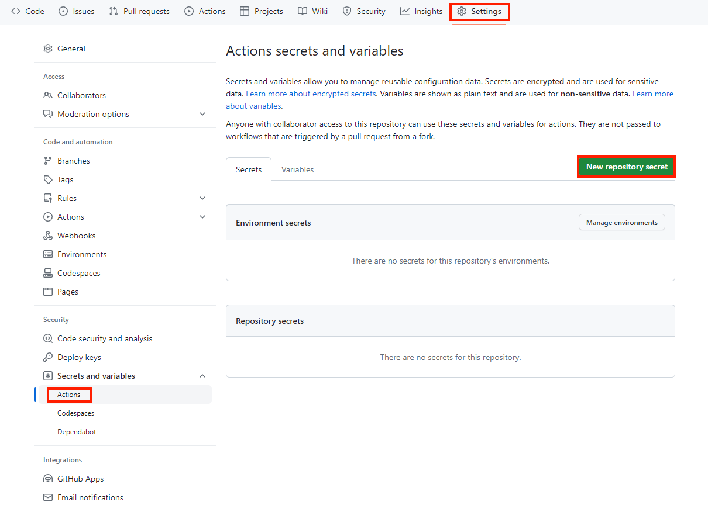

# Sphinx導入とGitHubページ作成

## Sphinxのインストール（Windows）
[公式ドキュメント](https://www.sphinx-doc.org/ja/master/usage/installation.html#)を参考にする。

本手順ではすでにPythonがインストールされていることを前提とした手順をメモする

1. コマンドプロンプトを起動して、Pythonがインストールされていることを確認する
```
C:\Users\masak>python --version
Python 3.11.4
```

2. pipコマンドでSphinxインストール
```
C:\Users\masak>pip install -U sphinx
```

3. インストールされたことを確認
```
C:\Users\masak>sphinx-build --version
sphinx-build 7.2.6
```

## Sphinxプロジェクトの作成とテーマの適用
1. プロジェクトを作成したい任意のディレクトリで、プロジェクトを作成
```
C:\Users\masak\ドキュメント\noimemo>sphinx-quickstart
Welcome to the Sphinx 7.2.6 quickstart utility.

Please enter values for the following settings (just press Enter to
accept a default value, if one is given in brackets).

Selected root path: .

You have two options for placing the build directory for Sphinx output.
Either, you use a directory "_build" within the root path, or you separate
"source" and "build" directories within the root path.
> Separate source and build directories (y/n) [n]: y

The project name will occur in several places in the built documentation.
> Project name: noimemo
> Author name(s): noim
> Project release []:

If the documents are to be written in a language other than English,
you can select a language here by its language code. Sphinx will then
translate text that it generates into that language.

For a list of supported codes, see
https://www.sphinx-doc.org/en/master/usage/configuration.html#confval-language.
> Project language [en]: ja

Creating file C:\Users\masak\ドキュメント\noimemo\source\conf.py.
Creating file C:\Users\masak\ドキュメント\noimemo\source\index.rst.
Creating file C:\Users\masak\ドキュメント\noimemo\Makefile.
Creating file C:\Users\masak\ドキュメント\noimemo\make.bat.

Finished: An initial directory structure has been created.

You should now populate your master file C:\Users\masak\ドキュメント\noimemo\source\index.rst and create other documentation
source files. Use the Makefile to build the docs, like so:
   make builder
where "builder" is one of the supported builders, e.g. html, latex or linkcheck.
```

こんな感じのファイルが生成される

2. Sphinxの拡張テーマ（sphinx_rtd_theme）をインストール
```
pip install sphinx_rtd_theme
```

3. 拡張テーマ適用のため、`source > conf.py`ファイルの`html_theme`オプションを選択
```
# -- Options for HTML output -------------------------------------------------
# https://www.sphinx-doc.org/en/master/usage/configuration.html#options-for-html-output

html_theme = 'sphinx_rtd_theme'
```

4. 後述するGithubページへの適用のため、`docs`フォルダの作成および、ビルドのディレクトリ構成を変更する。`make.bat`の`BUILDDIR`を変更する。

※ `make.bat`ファイルはWindows環境でビルドするためのバッチファイルのため、今回はこちらを編集する。`Makefile`はLinux環境でビルドするためのファイル。
```
C:\Users\masak\ドキュメント\noimemo>tree /f
フォルダー パスの一覧
ボリューム シリアル番号は A0DF-CFEF です
C:.
│  make.bat
│  Makefile
│
├─build
├─docs         # 新規作成
└─source
    │  conf.py
    │  index.rst
    │
    ├─_static
    └─_templates
```

```
@ECHO OFF

pushd %~dp0

REM Command file for Sphinx documentation

if "%SPHINXBUILD%" == "" (
	set SPHINXBUILD=sphinx-build
)
set SOURCEDIR=source
set BUILDDIR=docs    # 編集

%SPHINXBUILD% >NUL 2>NUL
if errorlevel 9009 (
	echo.
	echo.The 'sphinx-build' command was not found. Make sure you have Sphinx
	echo.installed, then set the SPHINXBUILD environment variable to point
	echo.to the full path of the 'sphinx-build' executable. Alternatively you
	echo.may add the Sphinx directory to PATH.
	echo.
	echo.If you don't have Sphinx installed, grab it from
	echo.https://www.sphinx-doc.org/
	exit /b 1
)

if "%1" == "" goto help

%SPHINXBUILD% -b %1 %SOURCEDIR% %BUILDDIR% %SPHINXOPTS% %O%    # 編集
goto end

:help
%SPHINXBUILD% -M help %SOURCEDIR% %BUILDDIR% %SPHINXOPTS% %O%

:end
popd
```

5. GitHub Pagesはサイトをビルドするのにデフォルトで`Jekyll`を利用するが、この場合、`_static`や`_images`フォルダが認識されなくなってしまう。そこで、Sphinxの`conf.py`に以下の設定を追記する。
```
extensions = [
    "sphinx.ext.githubpages",
]
```
これにより、空ファイル`.nojekyll`が自動生成されるため、CSSや画像がうまく適用される。


## GitHub Pageの作成
1. GitHubでGitHubPages用のリポジトリを作成する。


2. Shpinxディレクトリに移動し、1で作成したリポジトリに記載のコマンドラインを実行する。
```
echo "# noimemo" >> README.md
git init
git add README.md
git commit -m "first commit"
git branch -M main
git remote add origin https://github.com/noimasaki/noimemo.git
git push -u origin main
```

3. Shpinxの他ファイル追加してプッシュする
```
git add .
git commit -m "add shpinx files"
git push origin main
```

4. GitHubで`Settings > Pages`を選択し、GitHub Pagesで公開するBranch（main）と、ビルドされたリソースが格納されたディレクトリ（docs）を設定して`Save`する。


## 記事の執筆
1. sourceフォルダ配下にmdファイル、もしくはrstファイルで記事を執筆する。
2. conf.pyに追加したファイルを追加する。


## Spinxのビルド & GitHub Pagesの確認
1. Shinxディレクトリにてビルドを実施
```
C:\Users\masak\ドキュメント\noimemo>make html
Running Sphinx v7.2.6
loading translations [ja]... done
making output directory... done
building [mo]: targets for 0 po files that are out of date
writing output...
building [html]: targets for 1 source files that are out of date
updating environment: [new config] 1 added, 0 changed, 0 removed
reading sources... [100%] index
looking for now-outdated files... none found
pickling environment... done
checking consistency... done
preparing documents... done
copying assets... copying static files... done
copying extra files... done
done
writing output... [100%] index
generating indices... genindex done
writing additional pages... search done
dumping search index in Japanese (code: ja)... done
dumping object inventory... done
build succeeded.

The HTML pages are in build\html.
```

2. Gitでコミット&プッシュする

3. GitHub Pagesの確認`https://GitHubのアカウント名.github.io/リポジトリ名/`で確認。

今回の場合は以下のURLとなる

[https://noimasaki.github.io/noimemo/](https://noimasaki.github.io/noimemo/#)

## GitHub Actionでビルドを自動化する
1. GitHub Actionでは`.github/workflows`配下にYAMLファイルで定義する必要がある。以下のように作成する。

```
yamlファイル
```

1. パーソナルアクセストークンの作成
今回つくるワークフローではGitHub Actionsがリポジトリにpushするというjobが必要なため、パーソナルアクセストークンを作成し、トークンをGitHub Actions Secretsに追加する必要がある。


