ログ出力方式ベストプラクティス
################################

ログ出力方式のベストプラクティスを整理する。

前提条件
============================
私の業務環境として「AWSで検証・開発を実施したうえでオンプレミスに移行する」といった開発スタイルが比較的よく行われている。
よって、今回のログ出力方式の検討を行うにあたって、以下の前提条件を設定する。

- AWSを利用したマイクロサービスアーキテクチャであること
- コンテナベースであること
- クラウド基盤→オンプレミスへの移植性も考慮した構成とすること
- ログ基盤の変更に対してアプリケーションへの影響が少ないこと

また、ログ処理フローのうち、下記の部分に着目する。

`[Black Belt Online Seminar] AWS上でのログ管理 <https://www.slideshare.net/AmazonWebServicesJapan/black-belt-online-seminar-aws-69708255>`_

.. todo:: オーバービューを入れても良いかも
    https://speakerdeck.com/hainet50b/spring-boot-3-dot-0-obuzababiriteituagaido

Why：なぜログが必要なのか？
============================

「ログは実行中のアプリケーションの挙動を可視化する」

[12factor](https://12factor.net/ja/logs)の冒頭文がログ出力としての目的の一つを端的に示している。
システム開発時には開発者はこのログをイベントストリームとしてターミナルのフォアグラウンドで見ることで、システムの挙動を確認する。

サービス提供中においても、長期にわたってシステムの挙動を確認することができる。
- 過去の特定のイベントを見つける
- 大きなスケールの傾向をグラフ化する。（1分あたりのリクエスト数など）
- ユーザー定義のヒューリスティクスに基づいて素早くアラートを出す。（1分あたりのエラー数がある閾値を超えた場合にアラートを出すなど）

How：どうやってログを集めるか？
=================================
ログ収集はPush型とPull型に大別される。

Push型
    監視対象に配置したエージェントからログ収集基盤に対してデータを送信

Pull型
    監視対象はローカル等の適当な場所にログを溜め、定期的にログ収集基盤が回収する

コンテナは短いライフサイクルが前提とされており、
コンテナ内部にデータ保管するとデータロストにつながることから、今回はPush型に着目する。

Dockerのログ出力の方法
-------------------------
- ホストマシンのデータ領域をマウントしてログを書き込む：「アプリケーションは標準出力にログを吐けばいい」という 12Twelve-Factor App の世界観を満たさなくなってしまう = インフラレイヤ変更がアプリケーションにも影響を及ぼす
- ログドライバーの利用： 候補としてあり
- サイドカーコンテナの利用： 候補としてあり
- アプリコンテナでロガーライブラリ等を利用して直接ログ基盤にログ出力：「アプリケーションは標準出力にログを吐けばいい」という 12Twelve-Factor App の世界観を満たさなくなってしまう = インフラレイヤ変更がアプリケーションにも影響を及ぼす

`ロギングドライバー <https://docs.docker.com/config/containers/logging/configure/#supported-logging-drivers>`_

Fargateのログ出力の仕組み
-------------------------
Fargateではログ収集機能をデフォルトで提供しており、下記から選択できる。

- `awslogs <https://docs.aws.amazon.com/AmazonECS/latest/developerguide/using_awslogs.html?icmpid=docs_ecs_hp-task-definition>`_ ： ログドライバーを利用してstdoutとstderrはCloudWathchへログが転送される
- `splunk <https://docs.docker.com/config/containers/logging/splunk/>`_ ：awslogsと同様にログドライバーを利用して、splunkにログを転送可能
- `firelens <https://docs.aws.amazon.com/AmazonECS/latest/developerguide/using_firelens.html?icmpid=docs_ecs_hp-task-definition>`_ ：ログドライバーとサイドカーを利用して柔軟度の高いログ転送が可能

ログ基盤変更においても柔軟に対応できるように、firelensでも利用されているサイドカー方式に着目する。

What：何のログを集めるか？
===================================
以下を参考として整理する。

- https://terasolunaorg.github.io/guideline/5.4.2.RELEASE/ja/ArchitectureInDetail/GeneralFuncDetail/Logging.html#id2
- https://www.dataset.com/blog/the-10-commandments-of-logging/

(a) ログ種類
--------------

.. csv-table::
    :file: _static/Logging/Log_list.csv
    :encoding: utf-8
    :header-rows: 1

(b) ログレベル
--------------

.. csv-table::
    :file: _static/Logging/Log_level.csv
    :encoding: utf-8
    :header-rows: 1

SLF4JやLogbackのログレベルの順番は、 TRACE < DEBUG < INFO < WARN < ERROR であり、FATALは存在しない。

(c) トレーサビリティ
マイクロサービスアーキテクチャにおいては、複数のマイクロサービスが連動して処理を行うことから、1つの通信に対するログをトレースすることが困難となる。

そこで、リクエストIDを付与したログを出力することでログトレースを可能とする。

ここまでのまとめと目指すもの
===================================
一枚でわかる図

実装例
===================================

.. toctree::
    Microservice_Logging.rst

成果のまとめ
===================================

.. todo:: `ここ <https://engineering.dena.com/blog/2022/08/firelens/>`_ のまとめを参考に総括する。