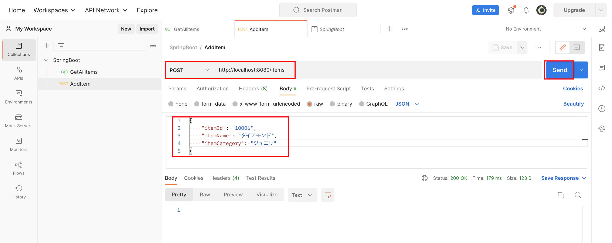

# SpringBootでREST API
SpringBootを利用した簡単なREST APIを作成する。

## 1. 環境構築
Visual Studio Codeを利用してSpringBootを開始する。

### 1-1. プロジェクト作成
VS Codeのコマンドパレットから新しくプロジェクトを作成

- Spring Boot version: 3.15
- project language: Java
- Group Id: com.example
- Artifact Id: item
- packaging type: Jar
- Java version: 17  ※ 実行環境のJavaバージョンと合わせる必要がある
- dependencies: Spring Web

作成されたディレクトリに、`Controller`フォルダ、`Model`フォルダ、`Service`フォルダを作成する

以下のようなフォルダ構成となる
```
item           // Spring Boot プロジェクディレクトリ
├── pom.xml
├── src
│   ├── main    // Javaファイルはここに作成
│   │   └── java/com/example/item
│   │       ├── ItemApplication.java
│   │       ├── Controller  // Controllerクラス用ディレクトリ
│   │       ├── Model       // Modelクラス用ディレクトリ
│   │       └── Service     // Serviceクラス用ディレクトリ
│   └── test
└── target      // ビルドしたjarファイルはここに格納される
```
### 1-2. モデル作成
1. ItemApplication.javaと同ディレクトリにモデル（Item.java）を作成し、次のオブジェクト作成
```
    private String itemId;          //商品ID
    private String itemName;        //商品名
    private String itemCategory;    //商品カテゴリー
```

1. GetterとSetterを作成
コードを記載してももちろんOKだが、右クリックから
`ソースアクション > Generate Getters and Setters...`
を選択すると自動で作って便利


↓ GetterとSetterを作成したい対象を選択してあげると


3. コンストラクタを作成
こちらも`ソースアクション > Generate Constructors...`から作成すると便利


Item.java
```
package com.example.item.Model;

public class Item {
    private String itemId;          //商品ID
    private String itemName;        //商品名
    private String itemCategory;    //商品カテゴリー

    // コンストラクタ
    public Item(String itemId, String itemName, String itemCategory) {
        this.itemId = itemId;
        this.itemName = itemName;
        this.itemCategory = itemCategory;
    }
    // GetterとSetter
    public String getItemId() {
        return itemId;
    }
    public void setItemId(String itemId) {
        this.itemId = itemId;
    }
    public String getItemName() {
        return itemName;
    }
    public void setItemName(String itemName) {
        this.itemName = itemName;
    }
    public String getItemCategory() {
        return itemCategory;
    }
    public void setItemCategory(String itemCategory) {
        this.itemCategory = itemCategory;
    }
}
```

### 1-3. サービス作成
1. コントローラから呼ばれるビジネスロジックであるItemService.javaを作成
```
package com.example.item.Service;

import java.util.Arrays;
import java.util.List;

import org.springframework.stereotype.Service;

import com.example.item.Model.Item;

@Service
public class ItemService {
        private List<Item> allItems = Arrays.asList(
            new Item("10001", "ネックレス", "ジュエリ"),
            new Item("10002", "パーカー", "ファッション"),
            new Item("10003", "フェイスクリーム", "ビューティ"),
            new Item("10004", "サプリメント", "ヘルス"),
            new Item("10005", "ブルーベリー", "フード")
        );

        // 全てのItemリストを返すメソッド
        public List<Item> getAllItems() {
            return allItems;
        }

        // 個別のItemを返すメソッド
        public Item getItem(String itemId) {
            for (int i=0; i<allItems.size(); i++){
                if (allItems.get(i).getItemId().equals(itemId)) {
                    return allItems.get(i);
                }
            }
            return null;    // itemIdが見つからなかったらnullを返す
        }
}
```

### 1-4. コントローラ作成
1. ItemController.javaを作成
```
package com.example.item.Controller;

import java.util.List;

import org.springframework.beans.factory.annotation.Autowired;
import org.springframework.web.bind.annotation.GetMapping;
import org.springframework.web.bind.annotation.PathVariable;
import org.springframework.web.bind.annotation.RestController;

import com.example.item.Model.Item;
import com.example.item.Service.ItemService;

@RestController
public class ItemController {
    
    // @Autowiredでインスタンス化は自動化
    @Autowired
    private ItemService itemService;

    // @GetMappingで"/items"へアクセスしたときにgetAllItems()を実行
    @GetMapping("/items")
    public List<Item> getAllItems() {
        return itemService.getAllItems();
    }

    // 全てのitemではなく、itemIdで個別の情報を返す
    @GetMapping("/items/{id}")
    public Item getItem(@PathVariable("id") String id){
        return itemService.getItem(id);
    }
}
```


## 2. GET（参照）
`1. 環境構築`が完了していれば、GETは実装できたことになる。

1. SpringBootを起動する


2. ブラウザで[http://localhost:8080/items](http://localhost:8080/items)にアクセスして、JSON形式で表示されればOK


3. 個別のitem情報も取得できるか確認[http://localhost:8080/items/10001](http://localhost:8080/items/10001)


確認できたらSpringBootは停止する


## 3. POST（登録）


ポイント
- サービスクラスに記述しているArrayにaddしようとするとエラーが発生するので、ArrayList<>でnewしてあげる必要がある
```
public class ItemService {
        private List<Item> allItems = new ArrayList<> (Arrays.asList(
            new Item("10001", "ネックレス", "ジュエリ"),
            new Item("10002", "パーカー", "ファッション"),
            new Item("10003", "フェイスクリーム", "ビューティ"),
            new Item("10004", "サプリメント", "ヘルス"),
            new Item("10005", "ブルーベリー", "フード")
        ));
```

PostmanでPOSTして確認してみる


## 4. PUT(更新)


## 5. DELETE (削除)


## データベース（MySQL）を利用する


### データベース作成
MySQL Workbenchからデータベースを作成


### プロジェクト作成
1. VS Codeのコマンドから新しくプロジェクトを作成

- Spring Boot Version : 3.1.5 （一番上のやつ）
- project language : Java
- Group 