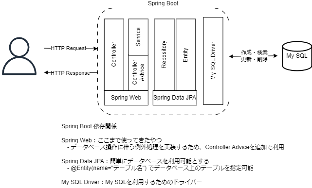
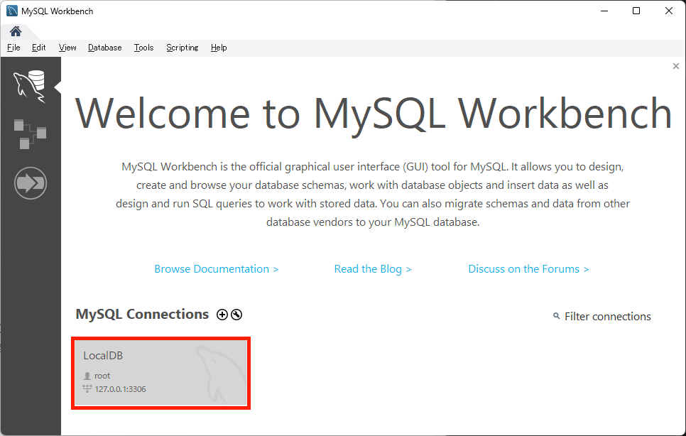
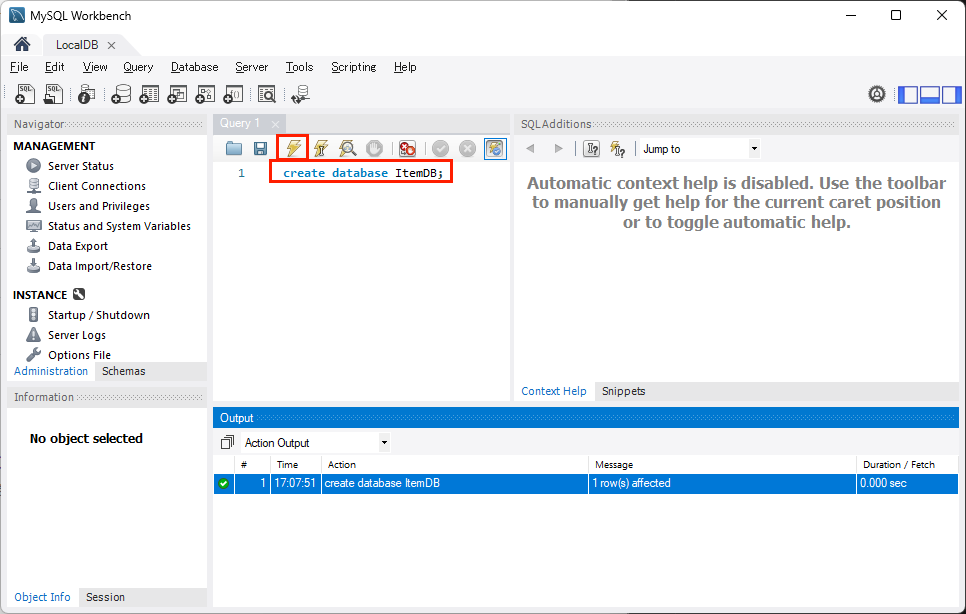

# SpringBootでREST API
SpringBootを利用した簡単なREST APIを作成する。

## 環境構築
Visual Studio Codeを利用してSpringBootを開始する。

## 1. プロジェクト作成
VS Codeのコマンドパレットから新しくプロジェクトを作成

- Spring Boot version: 3.15
- project language: Java
- Group Id: com.example
- Artifact Id: item
- packaging type: Jar
- Java version: 17
- dependencies: Spring Web

以下のようなフォルダ構成が出来上がる
```
item           // Spring Boot プロジェクディレクトリ
├── pom.xml
├── src
│   ├── main    // Javaファイル、htmlファイルはここに作成
│   │   ├── java/com/example/item
│   │   │   ├── ItemApplication.java
│   │   │   └── ItemApplication.java
│   │   └── resources/templates
│   └── test
└── target      // ビルドしたjarファイルはここに格納される
```


## 2. GET（参照）の実装

## データベース（MySQL）を利用する


### データベース作成
MySQL Workbenchからデータベースを作成



### プロジェクト作成
1. VS Codeのコマンドから新しくプロジェクトを作成

- Spring Boot Version : 3.1.5 （一番上のやつ）
- project language : Java
- Group 