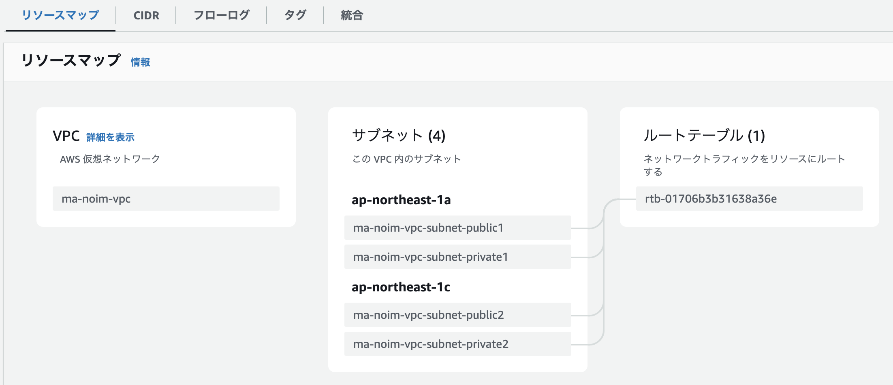

# マイクロサービス作成② （AWS環境の構築）
## 実施すること
AWS上でコンテナが動作する環境を構築する。まずは基本的な構成を作成して動作できることを目指す。

## 作成の流れ
1. VPC作成
2. ALB作成
3. コンテナのDockerHubへのプッシュ
4. ECSクラスタ作成
5. ECSタスク定義
6. ECSサービス実行

## 1. VPC作成
### 1-1. VPC作成 [VPC > お使いのVPC > VPC を作成]
  - 作成するリソース：VPCのみ
  - 名前タグ：ma-noim-vpc
  - IPv4 CIDR：10.2.76.0/24
設定できたら「VPCを作成」

### 1-2. サブネット作成 [VPC > サブネット > サブネットを作成]
  - VPC ID：ma-noim-vpc
その他の設定は以下のように4つのサブネットに分割する

| サブネット名 | アベイラビリティーゾーン | IPv4 subnet CIDR block |
| ---- | ---- | ---- |
| ma-noim-vpc-subnet-public1 | ap-northeast-1a | 10.2.76.0/26 |
| ma-noim-vpc-subnet-public2 | ap-northeast-1c | 10.2.76.64/26 |
| ma-noim-vpc-subnet-private1 | ap-northeast-1a | 10.2.76.128/26 |
| ma-noim-vpc-subnet-private2 | ap-northeast-1c | 10.2.76.192/26 |

### 1-3. ルートテーブル作成 [VPC > ルートテーブル > ルートテーブルを作成]
ここまで作成したサブネットはデフォルトのルートテーブルに接続されている。

デフォルトのルートテーブルはNATゲートウェイのルーティングが有効化されているプライベートサブネット向けであるため、インターネットからアクセス可能としたいパブリックサブネットは、インターネットゲーウェイのルーティングが有効化されているカスタムルートテーブルに紐づける必要がある。

まずは、カスタムルートテーブルを作成する。
  - 名前：ma-noim-vpc-rtb-pub
  - VPC：ma-noim-vpc

カスタムルートテーブルをサブネットに紐づける。[VPC > ルートテーブル > rtb-ID > サブネットの関連付けを編集]
  - 関連付け対象①：ma-noim-vpc-subnet-public1
  - 関連付け対象②：ma-noim-vpc-subnet-public2

### 1-4. インターネットゲートウェイ作成 [VPC > インターネットゲートウェイ > インターネットゲートウェイの作成]
カスタムルートテーブルのデフォルトゲートウェイにインターネットゲートウェイを紐づけるために、インターネットゲートウェイを作成する
  - 名前：ma-noim-vpc-igw

作成したigwをVPCにアタッチする[VPC > インターネットゲートウェイ > VPC にアタッチ (インターネットゲートウェイID)]
  - 使用可能なVPC：ma-noim-vpc

### 1-5. カスタムルートテーブルにルートを追加 [VPC > ルートテーブル > rtb-ID > ルートを編集]
igwの作成ができたら、ルートテーブルの設定を開き、ルートを追加する
  - 送信先：0.0.0.0/0
  - ターゲット：ma-noim-vpc-igwのインターネットゲートウェイID

## 2. ALB作成
インターネットからフロントエンドへのアクセスだけでなく、フロントエンドからバックエンドへのアクセスもHTTPを利用した構成であるため、ロードバランサにはアプリケーションロードバランサ（ALB）を利用する。また、パブリックサブネットへのアクセスとプライベートサブネットへのアクセスはアクセス元を制御する（プライベートサブネットへはインターネットからの通信を遮断）必要があるので、publicとprivateはそれぞれ別のALBを用意して、セキュリティグループにてアクセス制御を実施します。

### 2-1. セキュリティグループ作成
それぞれのALBに適用するセキュリティグループを作成しておきます。

[EC2 > セキュリティグループ > セキュリティグループを作成]

  - ①インターネット→パブリックサブネットのセキュリティグループ
  - セキュリティグループ名：ma-noim-sg-pub
  - VPC：ma-noim-vpc
  - インバウンドルール：HTTP(80番ポート)、ソースは0.0.0.0/0

  - ②パブリックサブネット→プライベートサブネットのセキュリティグループ
  - セキュリティグループ名：ma-noim-sg-pri
  - VPC：ma-noim-vpc
  - インバウンドルール：HTTP(80番ポート)、ソースは10.2.76.0/24

| ---- | public向け | private向け |
| ---- | ---- | ---- |
| セキュリティグループ名 | ma-noim-sg-pub | ma-noim-sg-pri |
| VPC | ma-noim-vpc |  |

### 2-2. ターゲットグループ

[EC2 > ターゲットグループ > ターゲットグループの作成]
#### パブリックサブネット向け
  - ターゲットタイプ：インスタンス
  - ターゲットグループ名：ma-noim-tg-pub
  - プロトコル/ポート：HTTP/80
  - VPC：ma-noim-vpc
  - ヘルスチェク：/index.html

ターゲットを登録する画面は、後にECSサービスを作成する時に指定するので空欄で作成する。

#### プライベートサブネット向け

### 2-1. ALB作成

[EC2 > ロードバランサー > ロードバランサータイプの比較と選択]

#### パブリックサブネット向け
  - ロードバランサータイプ：Application Load Balancer
  - ロードバランサー名：ma-noim-alb-pub
  - スキーム：インターネット向け
  - VPC：ma-noim-vpc
  - マッピング：ma-noim-vpc-subnet-public1, ma-noim-vpc-subnet-public2
  - セキュリティグループ：ma-noim-sg-pub
  - 