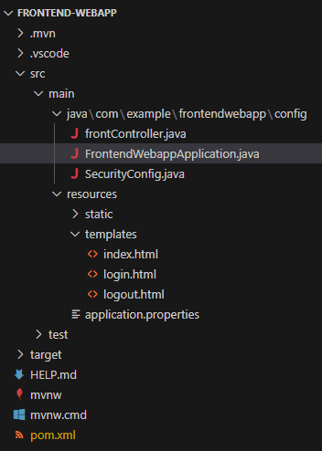
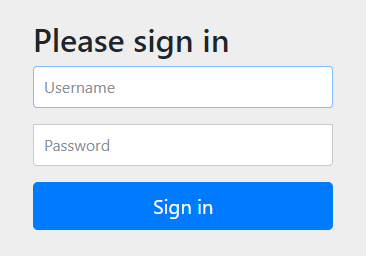

# 認証機能の実装
ここでは、マイクロサービスにおけるフロントエンドに相当する認証機能を持ったアプリケーションを作成する。

## 1. Spring Initializr
動作環境
- Java: 17
- SpringBoot: 3.2.0

dependencies
- spring-boot-starter-security
- spring-boot-starter-thymeleaf
- spring-boot-starter-web

## 2. ディレクトリ構成変更
configディレクトリを作成し、起動クラスと設定クラスをまとめて格納する。設定クラスが散らばることがないので良い。

以下のようなフォルダ構成でファイルを作成していく



## 3. ログイン機能の実装
### 3-1. ログインページを表示してみる
dependenciesにて`spring-boot-starter-security`を指定していれば、そのまま起動するだけでログイン・ログアウト機能が使える。


- ユーザ名：`user`
- パスワード：起動ログの中に記載されている。以下のようなログが出力されている。
```
Using generated security password: 827bc10f-d2e7-426a-9bca-71a10e399f74
```

ただし、ログインしてもログイン後のページがないので、`Whitelabel Error Page`が表示されるだけ。


### 3-2. `.html`作成
ログインページ、ログイン後のページを作成する。

ログインページ`resources/templates/login.html`
```
<!DOCTYPE html>
<!-- Thymeleafを有効化 => th:XXXX という属性を各タグに追加することで利用可能 -->
<html xmlns:th="http://www.thymeleaf.org">
<head>
    <title>ログインページ</title>
</head>
<body>
    <h1>Microservice WebApp Login</h1>

    <!-- URLパラメータに「error」が含まれていたら、メッセージ出力 -->
    <div th:if="${param.error}">
        <p>ユーザー名もしくはパスワードが違います</p>
    </div>

    <!-- ユーザ名・PWをサーバへ送信するためのForm -->
    <!-- submitボタンが押下された時のaction（URLパス`/login`へ`post`する）※@はthのリンク記法 -->
    <!-- `action="#" はThymleafが有効化されていれば上書きされる -->
    <form action="#" th:action="@{/login}" method="post">
        <div>
            <label for="usernameInput">ユーザ名</label>
            <input type="text" id="usernameInput" name="username">
            <!-- name="username"はSecurityConfig.javaにてフィールド名指定を合わせる必要がある -->
        </div>
        <div>
            <label for="passwordInput">パスワード</label>
            <input type="password" id="passwordInput" name="password">
            <!-- name="password"はSecurityConfig.javaにてフィールド名指定を合わせる必要がある -->
        </div>
        <div>
            <button type="submit">ログイン</button>
        </div>
    </form>
</body>
</html>
```


ログイン後のページ`resources/templates/home.html`
```
<!DOCTYPE html>
<html xmlns:th="http://www.thymeleaf.org">
<head>
    <title>Welcomeページ</title>
</head>
<body>
    <div>Successful Login!</div>

    <ul>
        <li><a href="./logout.html" th:href="@{/logout}">ログアウト</a></li>
    </ul>
</body>
</html>
```


ログアウトページ`resources/templates/logout.html`。ログアウトボタンを押下するとログアウトして、`login.html`に飛ばされる。
```
<!DOCTYPE html>
<html xmlns:th="http://www.thymeleaf.org">
<head>
    <title>ログアウトページ</title>
</head>
<body>
    <h1>Microservice WebApp Logout</h1>
    <form action="#" th:action="@{/logout}" method="post">
        <div>
            <button type="submit">ログアウト</button>
        </div>
    </form>
</body>
</html>
```

### 3-3. `frontController.java`作成
`login.html`と`home.html`と`logout.html`を表示させるコントローラを作成する

```
package com.example.frontendwebapp.config;

import org.springframework.stereotype.Controller;
import org.springframework.web.bind.annotation.GetMapping;

@Controller
public class frontController {
    @GetMapping
    public String home(){
        return "home";
    }

    @GetMapping("/login")
    public String showLogin(){
        // Thymeleafを利用しているため、記載で`/resources/templates/login.html`をreturnする
        return "login";
    }

    @GetMapping("/logout")
    public String showLogout(){
        return "logout";
    }
}
```

### 3-4. `SecurityConfig.java`作成
SpringSecurityの挙動をカスタムする

```
package com.example.frontendwebapp.config;

import org.springframework.context.annotation.Bean;
import org.springframework.context.annotation.Configuration;
import org.springframework.security.config.annotation.web.builders.HttpSecurity;
import org.springframework.security.config.annotation.web.configuration.EnableWebSecurity;
import org.springframework.security.web.SecurityFilterChain;

@Configuration
@EnableWebSecurity
public class SecurityConfig {
    
    // 戻り値がBeanに登録される。BeanとはDIコンテナに登録されるオブジェクトのこと。結果として任意の場所でAutowiredできる。
    @Bean
    protected SecurityFilterChain configure(HttpSecurity http) throws Exception {
        http
            .authorizeHttpRequests((requests) -> requests
            .requestMatchers("/login/*").permitAll()    // "/login"は認証不要
            .anyRequest().authenticated()               // その他のリクエストは認証が必要
            )
            .formLogin((form) -> form   // 認証方式はformログイン
            .loginPage("/login")    // 認証ページは"/login"
            .permitAll()
            )
            .logout((logout) -> logout.permitAll());    // ログアウト機能を有効化し、すべてのユーザがログアウト可能
        
            return http.build();
    }

    // @Bean
    // public PasswordEncoder passwordEncoder() {
    //     return new Pbkdf2PasswordEncoder();
    // }

    // userDetailsServiceやpasswordEncoderについてはAutowiredできるものがあれば、自動でAutowiredして利用してくれるので不要。
    // userDetailsServiceはCustomUserDetailsServiceの中で@ServiceアノテーションをつけてServiceとしてDIコンテナに登録しているので、Springは勝手に読み取って使ってくれる
    // passwordEncoderについても同様に、PasswordEncoderConfigの中で@BeanをつけてDIコンテナに登録しているので、Pbkdf2PasswordEncoderを自動で使ってくれる
}

```

