# CodeServerでリモートから開発



- firewallに阻まれる
- code serve-web --host=192.168.10.10 --without-connection-token
- で起動されるものはブラウザからアクセスできる。（firewalldは停止した）

Linuxサーバに[Visual Studio Code](https://code.visualstudio.com/)をインストールして、クライアントPCからブラウザとVSCodeからアクセスする。

## インストール
```
# インストール
sudo dnf install code

```

## トンネル接続


## ブラウザ接続
とりあえず起動してみる。これで[http://192.168.10.10:8000](http://192.168.10.10:8000)でアクセスできる。
```
code serve-web --host=192.168.10.10 --without-connection-token
```

自動起動の為にserviceファイルを作成
```{code-block}
:caption:/etc/systemd/system/vscode-server.service
[Unit]
Description = VSCode Server Service

[Service]
ExecStart = /usr/bin/code serve-web --host=192.168.10.10 --without-connection-token
Restart = always # 常に再起動
User=noim

[Install]
WantedBy = multi-user.target
```

自動起動設定
```
# .service リロード
sudo systemctl daemon-reload

# 起動
systemctl start vscode-server

# 自動起動設定
systemctl enable vscode-server
```

## 参考
- [https://qiita.com/ku_suke/items/07b67bd710b17a3a7cf3](https://qiita.com/ku_suke/items/07b67bd710b17a3a7cf3)


