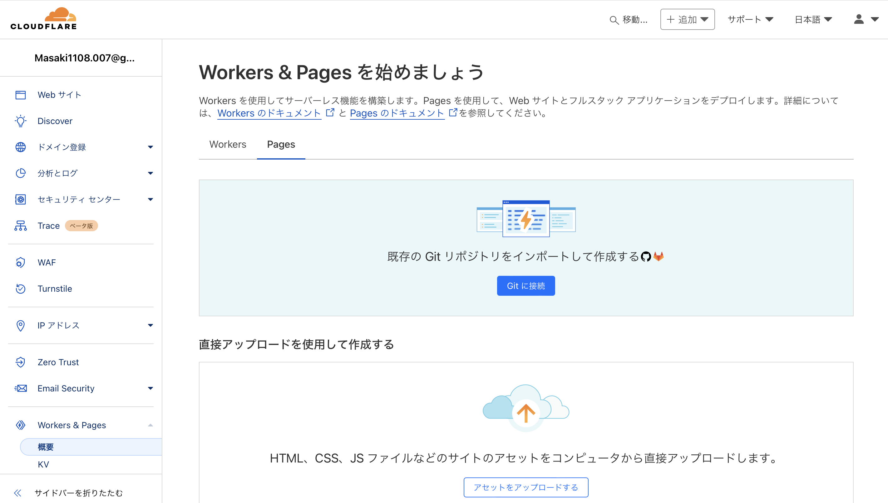
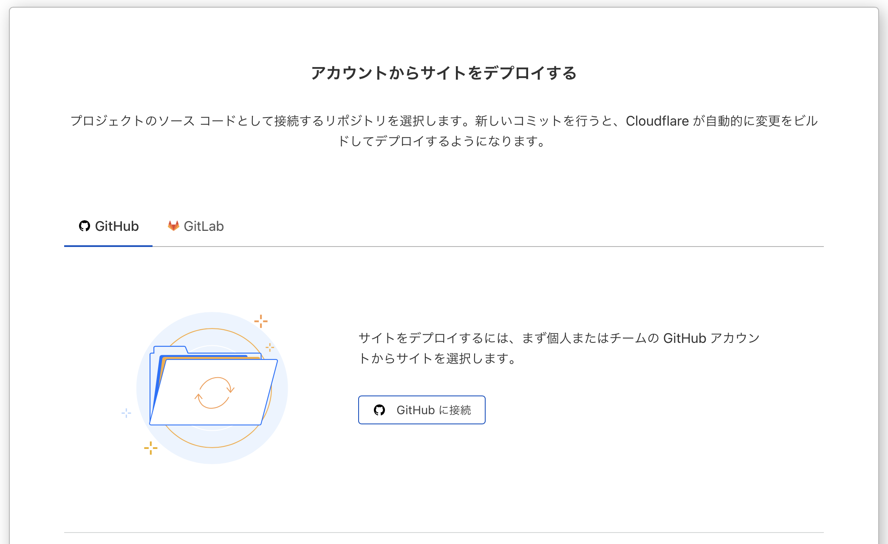
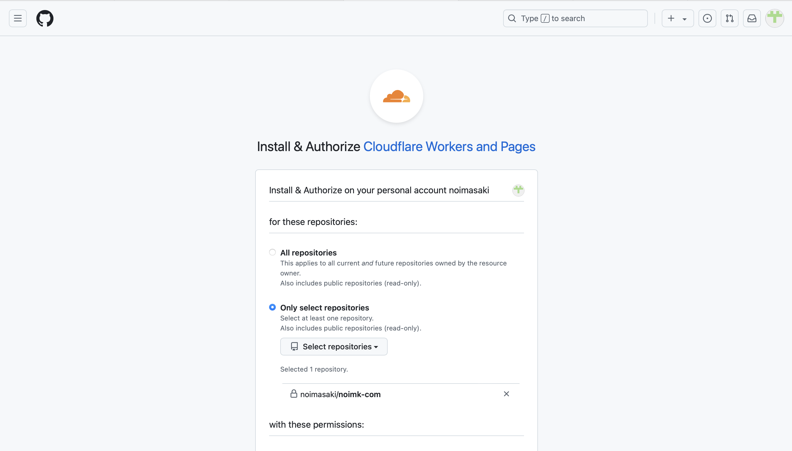
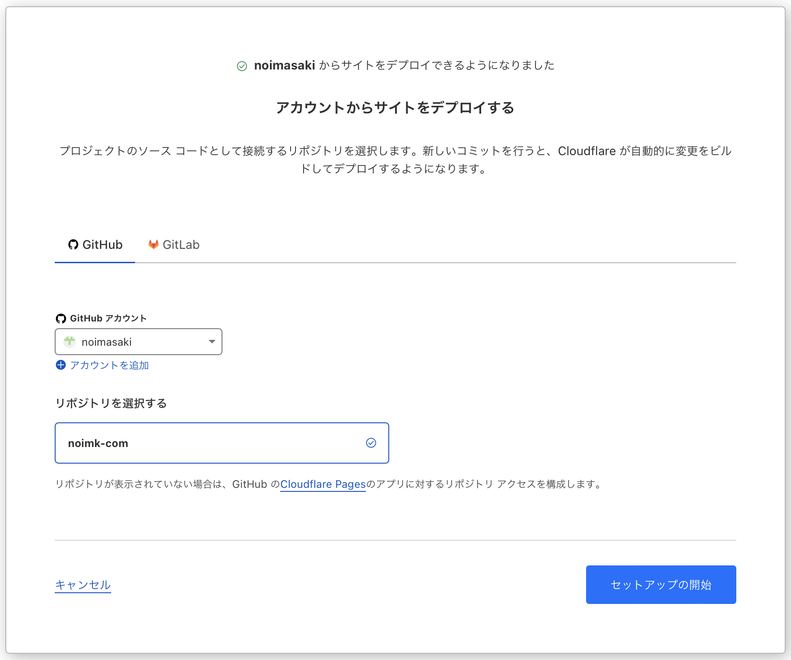
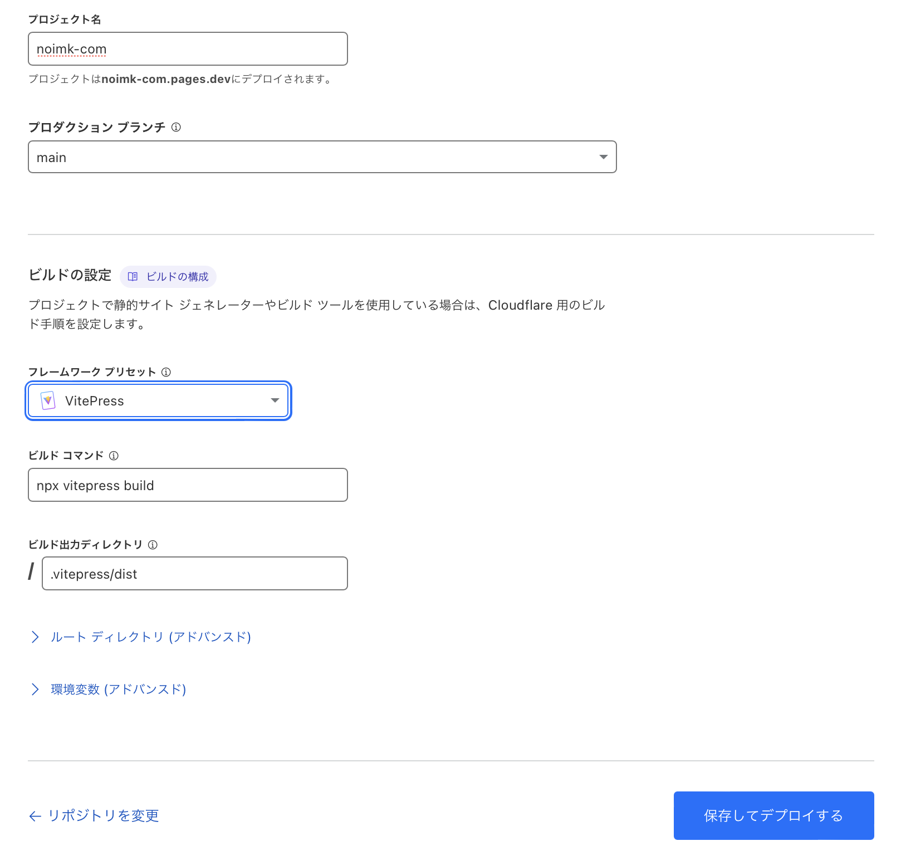
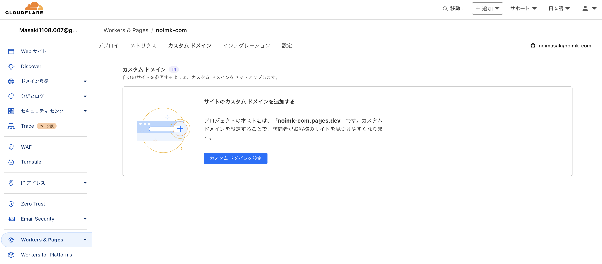
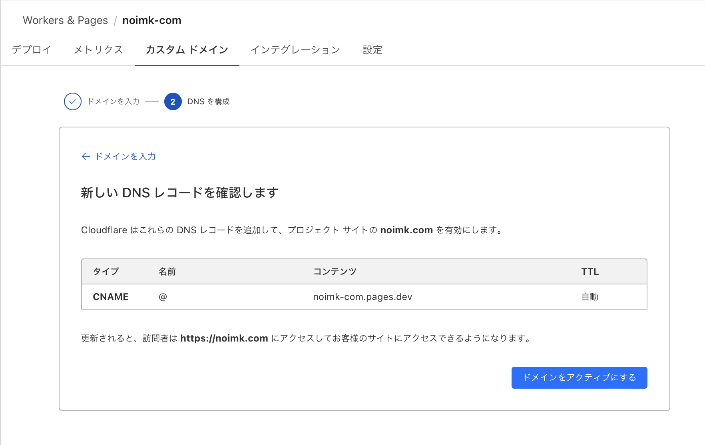

# VitePress のセットアップ

今まで Sphinx を GitHubPages で利用していたが、CloudflarePages を利用してみたくなり、せっかくなら html ビルダーツールも変更してみることにした。

デザインが気に入った VitePress を利用してみることにする。

[このサイト](https://nshmura.com/posts/migration-to-vitepress/#はじめに)を参考にする。

## セットアップ

macbook に Node.js をインストール

```
brew install node
```

VitePress のインストール

```
npm install vitepress
```

サイトの初期化

```
npx vitepress init
```

初期化で色々聞かれるので入力していく。

初期化が完了したら、gitHub で管理する必要のないものは除外する。`.gitignore`を作成して、以下を記述する。

```
# Node.jsの依存関係フォルダー
node_modules/

# 一時的なビルド成果物
.vitepress/cache/

# OSやエディタによる一時ファイル
.DS_Store
```

コレで VitePress のセットアップは完了したので、開発サーバを起動してみて確認してみる。

```
npm run docs:dev
```

ここから、cloudflarepages を用いてブログを公開する。

「Git に接続」をクリック



今回は、GitHub をリポジトリとするため、「GitHub に接続」をクリック



CloudFlare からアクセスさせたいリポジトリを選択する。



CloudFlare の画面に戻るので、リポジトリを選択して、「セットアップの開始」をクリック



ビルドとデプロイのセットアップを行う。今回は main ブランチに commit された内容を CloudFlarePages で表示する。フレームワークプリセットで「VitePress」を選択する。



セットアップが完了すると、すぐにビルド・デプロイが実施される（すごい）


このまま、カスタムドメインの設定を実施する。




